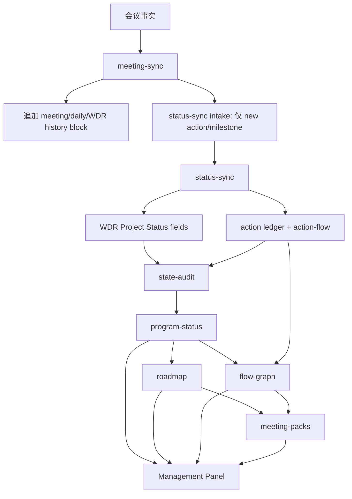
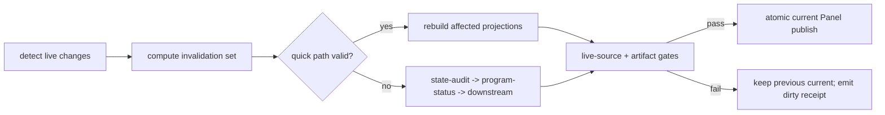

# ADP Management Panel 信息滞后与同步困难分析及优化方案

## 结论

当前问题不是单一的“Panel 刷新慢”，而是事实 mutation、派生 projection、freshness gate 和 repair contract 之间缺少闭环。五个现象可归并为四个根因：

1. `meeting-sync` 仍以“追加会议证据”为主，没有稳定表达“修改哪个现有实体、只修改哪些字段”。
2. Panel 只验证当前 projection/artifact 是否自洽，没有验证 projection 记录的源指纹是否仍等于实时 WDR/ledger。
3. checkpoint、meeting、status 与 risk workflow 还会直接写 WDR、daily、decision、receipt 或派生 index，没有共同的 fact-generation fence；仅在 Panel 末端加检查仍存在 TOCTOU。
4. canonical view 同时被当作下一轮输入与本轮输出，history、current pointer和projection publication边界未分开。

因此，继续在 Panel 内补读取逻辑会扩大双重事实源。正确方向是保留现有 owner workflow 边界，引入 typed mutation、live-source freshness、完整 projection drift audit 和显式 refresh orchestrator。

建议严格按 runtime/fact fence、typed mutation、projection publication、freshness/drift、repair、UX 六步实施。strict freshness 只能在所有影响 projection 的 fact writer 接入 generation fence 后启用；迁移前明确返回 `migration-required`，不能把 best-effort fingerprint 检查包装成强一致。

## 建议决策

批准以下架构方向后即可进入实现拆分：

1. `status-sync` 独占 action ledger、action-flow、全部 WDR current fields和Roadmap；risk review独占risk-flow与decision fact，但只能通过registry allowlisted `owned-fact-command/1.0.0`写入；所有canonical memory fact writers统一接入fact transaction与generation。
2. meeting sync plan 和 status-sync batch 发布 v2 typed action contract；meeting、checkpoint、risk 对current fields统一发布`status-mutation-intent/1.0.0`，producer command与同一fact journal向outbox提交exact intent bytes/hash，禁止从history文字合成payload。
3. shared WDR engine使用宿主capability验证writer，完整覆盖Identity/Project Status/Last status sync/Roadmap/owned sections/meeting history；create直接提交pinned-template canonical bytes。
4. 各 producer只消费immutable generation handles；current projection永远不是同轮leaf，所有canonical views与Panel pointer在同一publication transaction切换。
5. Management Panel v2采用加法升级：完整保留现有`model_v1`及其consumer bindings，只在并列`sync`域加入canonical current fields、freshness、drift和audit；不迁移或删除现有view/history/board结构。
6. Panel把`artifact_integrity`、`business_freshness`与`publication_eligibility`分开计算；只有audit通过、live source fresh且selected drift全部`in-sync`时才允许发布。
7. drift producer与state-audit共用content-addressed typed finding；audit输出exact action IDs与per-batch repair binding，repair read set从同一份真实ledger/WDR/sidecar bytes推导。
8. 以pinned registry、schema、protocol和vectors作为wire truth；两套独立实现通过是implementation release gate，而不是本轮架构文档虚构的完成状态。
9. release acceptance、strict open/inspect/publication使用独立host可信评估时间；release evidence和strict activation都通过generation/CAS-bound、可恢复的registered transition推进，activation lifecycle index逐step由committed receipt派生并形成exact prefix CAS，不能覆盖current文件或跳过迁移步骤。

这些决策不扩大 Panel 信息架构，也不要求迁移存储技术；它们只修复现有状态传播链的 identity、freshness、projection 和 repair 合约。

## 当前数据流与断点



当前断点：

- `meeting-sync -> status-sync` 不携带 existing action identity，所以 mutation 在入口丢失。
- `meeting-sync -> WDR` 写入 history block，而 `state-audit` 读取的是 `Project Status` 下的 current fields。
- `fact -> projection` 已记录 fingerprint，但 `projection -> Panel` 没有重算 live fingerprint。
- `ledger -> WDR Next actions` 有局部 ID 集合检查，但未覆盖空 ledger、内容漂移和 Panel gate。
- `raw audit item -> canonical finding` 在 canonicalization 时丢失 action identity。

## 五项问题的代码证据

### 1. meeting-sync 只能生成新 action

`skills/adp-meeting-sync/references/sync-plan-schema.md:42` 的 action item 只有文本、owner、status 等字段，没有 `operation`、`action_id` 或 revision。`build_status_sync_intake()` 在 `skills/adp-meeting-sync/scripts/sync_meeting.py:1371` 生成 action payload 时同样不输出 ID。

下游 `adp-status-sync` 实际已经支持 exact `action_id` 查找和 ledger row merge：解析位于 `skills/adp-status-sync/scripts/sync_status.py:544`，查找和 merge 位于 `skills/adp-status-sync/scripts/sync_status.py:840` 与 `:907`。也就是说，能力断点在 meeting contract，而不是 ledger writer 完全不支持更新。

现有 status-sync mutation 仍有一个隐患：`ActionUpdate.status` 默认 `open`，`merge_action_row()` 无条件写入 status。未来若只传 `action_id + owner`，遗漏的 status 可能把 action 重置为 `open`，或触发 terminal transition 错误。因此不能只给 meeting-sync 加一个 `action_id` 字段，必须同时引入 partial patch semantics。

影响：

- owner、status、due、closure criteria 的会议确认无法落到原 action。
- 同一工作被重复注册，ledger 与会议 archive 的 source lineage 分裂。
- close/cancel 只能靠后续人工找到 ID 再执行，会议闭环名义完成但事实未闭环。

### 2. wdr_update 没有更新 Panel 实际读取字段

`meeting-sync` 在 `skills/adp-meeting-sync/scripts/sync_meeting.py:812` 对所有可写 WDR item 调用 `append_file()`，并由 `render_wdr_block()` 在 `:1244` 生成 `## Meeting Sync Update` 区块。它没有调用 WDR current-field writer。

真正更新 `Status`、`Progress`、`Blockers`、`Risks`、`Dependencies` 的逻辑在 `skills/adp-status-sync/scripts/sync_status.py:1458` 和 `:1523`，但 `build_status_sync_intake()` 目前只把 action 和 milestone 放入 intake；纯 `wdr_update` 不进入这条路径。

影响：会议 archive 和 WDR 末尾看起来已经记录更新，但 prepass 仍从 `Project Status` 读取旧值，随后 program-status、meeting-pack 和 Panel 合法地继承旧状态。这是最容易制造“系统已同步”的错觉的一项。

### 3. Panel 检查不验证源数据是否更新

Panel 加载 canonical artifact 时，`resolve_artifact_audit()` 会确认当前 projection 文件的 bytes fingerprint、identity 和历史 artifact audit 匹配，见 `skills/adp-management-panel/scripts/management_panel.py:327`。这证明 projection 没被篡改，但不证明 projection 的源文件仍未变化。

`audit_panel_inputs()` 在 `skills/adp-state-audit/scripts/panel_audit.py:378` 只检查 `source_fingerprints` 的格式，在 `:489` 以 `generated_at` 和天数检查年龄。`_sealed_source_files()` 哈希的是本轮读入的 projection/audit 文件，不会把 projection 内记录的 WDR/ledger hash 与实时文件比较。

`inspect_current()` 在 `skills/adp-management-panel/scripts/management_panel.py:1120` 只比较 embedded manifest、immutable bundle 和资源 identity，也没有重新加载事实源。

影响：WDR 或 ledger 在 projection 生成后发生变化，只要 projection 本身未损坏且未超过固定天数，旧 Panel 仍可通过检查。同日多次同步时，基于 age 的 freshness 几乎无效。

### 4. WDR 与 ledger projection 漂移告警不完整

仓库已有一部分能力：`action_cross_check_evidence()` 在 `skills/adp-agent-program-lead/scripts/adp-state-prepass.py:911` 比较 active ledger action ID 与 WDR `Next actions` 中的 ID；`audit_consistency()` 在 `skills/adp-state-audit/scripts/audit_state.py:2282` 将差异变成 source disagreement。

但它还不满足当前需求：

- prepass 在 `skills/adp-agent-program-lead/scripts/adp-state-prepass.py:1154` 仅当存在 active ledger action 时才运行。全局 active set 为空、WDR 仍残留旧 ID 时会漏检。
- 比较对象只有 ID 集合，没有验证同一 ID 的 owner、action text、due 是否与 ledger 一致。
- finding 只在完整 state-audit 中产生，Management Panel pre-render gate 不消费这项 consistency evidence。
- WDR manual entry 与 ledger-managed entry 虽有 marker 约定，但 audit output 没有明确区分 ownership 和 repair action。

因此，这项应定性为“已有局部检测原语，但告警闭环缺失”，不需要从零重做 parser。

### 5. 审计结果丢失 action ID

raw action finding 由 `action_item()` 在 `skills/adp-state-audit/scripts/audit_state.py:3530` 创建，包含 `action_id`。`finding_identity_details()` 在 `:3001` 也把 ID 纳入 finding hash，说明 stable identity 已经依赖 action ID。

但 `canonical_finding()` 在 `:2974` 构造公开 finding 时没有复制 `action_id` 或 `action_ids`。后续 `flatten_findings()` 在 `:3341` 又尝试读取这些字段，因此 Markdown/JSON 都可能只剩 source 和自然语言 summary。

影响：审计能稳定识别“这是同一个 finding”，调用方却拿不到它针对的 action。批量修复必须重新解析 summary 或回查 ledger，既低效又有误匹配风险。

## 目标架构

### 1. Typed action mutation

meeting sync plan v2 增加 typed `action_commands`；其中每条 command 显式声明 `operation`：

```json
{
  "contract": {
    "schema_id": "urn:adp:panel-sync-contracts:2026-07-24#action-command-v2",
    "schema_sha256": "sha256:513d7232e59d50173fc8ef294ddb596d5f17306191ba171be8eaafd67d961a27",
    "registry_sha256": "sha256:182e0fd1eebfab54421c071f894026b6c6f4070cdb2745d79ccc4afdf2d802ae"
  },
  "schema_version": "2.0.0",
  "command_id": "cmd-mi-20260724-M-004",
  "operation": "patch",
  "action_id": "ACT-20260720-003",
  "expected_revision": 7,
  "set": {
    "owner": "FDE-B",
    "status": "blocked"
  },
  "evidence": [{
    "source_path": "meetings/2026-07-24-sync.md",
    "source_fingerprint": "sha256:0000000000000000000000000000000000000000000000000000000000000000",
    "observed_at": "2026-07-24T02:20:00Z"
  }]
}
```

规则：

- `operation=create` 必须提供 stable `command_id`、exact `action_id` 和现有 quality gate 要求的 owner、route、due、closure criteria。显式ID优先；缺显式ID时按pinned evidence/scope/action hash算法生成，collision fail closed。
- `operation=patch` 必须提供 exact `action_id`、`expected_revision` 和至少一个 `set` 字段。
- omitted 表示不修改；显式 empty 是否允许由字段 contract 决定，不能与 omitted 混用。
- legacy decoder 必须先记录 raw key presence，再构造 partial patch；不能先填 `open/TBD` 默认值。带 `action_id` 但 ledger 无 target 时返回 `ACTION_NOT_FOUND`，不得创建新 action。
- owner/status mutation 必须保留 action text、due、source origin 等未修改字段。
- ledger保留brownfield writer现有20列并追加独立`Action Revision`为第21列，不能复用含义不同的`Baseline Revision`。legacy 12/20列adapter只补缺失metadata与revision 1，首次写回不得丢失Created/Started/Done/Cancelled、baseline或relation字段；empty cell规范成`-`。
- create的Source/Reason、min Created At、max Last Updated、status-dependent lifecycle timestamps与metadata defaults全部从command/evidence确定；patch只改presence字段并更新source/reason/last-updated/revision。`done|cancelled`为terminal，不允许重开；合法status transition按protocol固定清理或补齐Started/Done/Cancelled。
- validator必须从exact before ledger执行command并重渲染21列after bytes，同时重建ledger state与action-flow；owner/status/text/due/closure/routing/affected任一回绑、omitted reset、terminal reopen或flow/state不一致都必须拒绝。
- receipt 记录 `before_revision`、`after_revision`、`changed_fields` 和 evidence source。
- status-sync 以 durable command ID index 实现幂等：相同 ID 和 fingerprint 重放为 no-op，相同 ID 对应不同 fingerprint 为 conflict。
- meeting-sync dry-run 只负责生成 intent 和显示 target；status-sync dry-run 是 mutation 可执行性的最终权威。
- `routing_scope_id`可以是physical workstream或`program`；只有physical workstream可以成为WDR target，program action不得合成虚假WDR。
- legacy offset/fraction RFC 3339先转换到UTC并向下截到整秒，再参与command/action identity；不得使用mtime或当前时间补齐证据时间。

不建议用文本相似度自动寻找 action。owner/status 变更是 destructive operation，exact ID 比“看起来像同一条”更重要。缺 ID 时应返回 candidate query 或 repair finding，由用户选择，不应自动 patch。

### 2. Typed status intent 与 WDR patch

`wdr_update` 继续保留原始会议文字作为 evidence，但meeting-sync不能直接取得current-field capability。pinned v1只有free text，无法确定性判断目标是progress、blocker、risk还是dependency，也没有collection mode；因此v1 free text只能生成history/evidence，并报告`LEGACY_STATUS_INTENT_REQUIRED` gap。只有v2输入或additive legacy extension已经携带schema-valid typed status payload时，meeting-sync才生成下面的结构化intent：

```json
{
  "contract": {
    "schema_id": "urn:adp:panel-sync-contracts:2026-07-24#status-mutation-intent-v1",
    "schema_sha256": "sha256:513d7232e59d50173fc8ef294ddb596d5f17306191ba171be8eaafd67d961a27",
    "registry_sha256": "sha256:182e0fd1eebfab54421c071f894026b6c6f4070cdb2745d79ccc4afdf2d802ae"
  },
  "schema_version": "1.0.0",
  "intent_id": "cmd-mi-20260724-M-006",
  "origin_producer": "adp-meeting-sync",
  "workstream_id": "l1-checkout",
  "set": {
    "status": "at-risk",
    "progress": "联调完成，等待支付回归证据",
    "blockers": {"mode": "replace", "values": ["支付沙箱权限未开通"]},
    "risks": {"mode": "add", "values": ["回归窗口压缩"]},
    "refresh_actions": true
  },
  "evidence": [{"source_path": "meetings/2026-07-24-sync.md", "source_fingerprint": "sha256:0000000000000000000000000000000000000000000000000000000000000000", "observed_at": "2026-07-24T02:20:00Z"}]
}
```

producer不能只把history command写完后让运行时猜intent。meeting/checkpoint/risk的typed command必须携带实际`status_intents`原文，command fingerprint与同一fact journal绑定这些bytes；journal同时更新`mutation-intent-outbox/1.0.0`，每条entry保存exact canonical intent、其JCS hash、source command ID/fingerprint、workstream、producer与field set。实现不得根据history文字、producer identity或固定模板合成`progress|blockers|risks`。

status-sync验证intent的evidence、precedence和CAS，再以自己的host capability生成`status-sync-batch/2.0.0`与`wdr-command/1.0.0`。accepted intents按`(workstream_id,intent_id)`排序，每个intent恰有一个同workstream binding，binding fields恰等于intent keys；同一workstream的全部accepted intents必须聚合成恰好一条WDR patch，拆成多条在执行前拒绝。同command字段只有JCS bytes完全相同才可合并，evidence按JCS去重排序，最终patch必须恰等于field/evidence union。聚合command携带完整sorted `consumed_intent_ids`，每项是bound intent canonical bytes的JCS hash；fact journal必须prefix-preserve无关outbox rows，并把所有selected pending same-workstream rows共同绑定同一fact receipt转为consumed。遗漏、额外、重复、已terminal、跨workstream或只消费一个代表intent均拒绝，business bytes与outbox一起恢复。action commands按command ID排序，WDR patches按`(workstream_id,command_id)`排序，`command_order`固定为前者后接后者。meeting-sync另发只包含`meeting_history_append`的WDR command，用自己的capability保存history/evidence；一个outer command可追加多row，但每个row的inner `command_id`必须等于outer command ID，且该command不得夹带任何current field。serialized `issuer`及wire graph里的capability副本只用于审计；runtime在fact lock内从registry注册路径读取canonical raw capability-registry bytes，OS边界另行提供host principal，engine用这两个非wire authority输入验证active epoch和field/section matrix。repair/recovery必须重新取得同一authority，不能从queue或repair graph恢复权限。

业务batch不是跨command原子事务：fact coordinator按`ordered-stop-on-first-failure-no-rollback`逐command重新预检和提交。首错停止，失败及后续command不提交，已committed前缀不回滚；恢复通过command ID+fingerprint查询durable fact receipt，第一个没有matching committed receipt的command就是retry cursor，从当前facts重读后继续。这样meeting history、action mutation和WDR refresh的部分成功是显式状态，不会被错误补偿成旧事实。

fact receipt的attribution不是展示字段。journal与receipt必须共同引用active capability registry ID、authorization record digest、authorized command fingerprint及producer/capability/epoch/principal；validator重算这些identity并与active record逐项相等。receipt还必须证明fact generation恰好`+1`、patch action revision恰好`+1`、business/generation targets与journal对应role完全相等。任一producer/capability/principal伪造、command fingerprint、target或revision跳变都在commit证据门禁中拒绝。

collection 必须显式声明 `replace|add|remove`。如果仍接受裸 `blockers: []`，调用方无法区分“清空 blockers”和“本次没有 blocker 信息”。

shared WDR mutation engine是唯一physical-byte writer，但semantic ownership仍严格分离：

- status-sync独占Identity current status/phase、Project Status全部current fields、`Last status sync`、ledger-backed `Next actions`和整个`Roadmap`。
- checkpoint-sync只直写`Checkpoint Sync Log`；它对current fields的变化改为status intent。risk review只直写risk-flow与decision fact，不拥有Dependencies或Cross-Workstream Links；其current-field变化同样改为status intent。
- workstream-register把schema-valid logical create input内嵌进WDR command；engine从command本体重算input ID、核对workstream ID、按pinned renderer重渲染whole-file bytes并验证hash后提交，不依赖out-of-band input。
- meeting-sync只拥有canonical Meeting Sync History region；任何queue file都不能靠自报owner获得其它section写权限。

每个WDR的权威revision/generation/fingerprint保存在同目录`delivery-record.state.json`。legacy缺sidecar时二者逻辑为0；首次成功transaction原子创建。首次patch先把现有status/checkpoint writer遗留的section order byte-preserving迁成canonical subsequence，并把旧`Meeting Sync Update`迁入history。缺`Last status sync`时固定插在`Next actions`之后；optional section按canonical total order插入。一个mixed command无论修改多少字段或section，最多使WDR revision和file generation各递增一次；纯history/owned-section只递增generation。duplicate section/meeting key、WDR/sidecar mismatch或unparseable legacy layout全部fail closed。

### 3. Live-source freshness gate

新增 `projection_dependency_manifest/1.0.0` 和可复用 validator，由 state-audit 实现，Management Panel 调用。manifest 不复用当前含义不统一的裸 `source_fingerprints` map，而使用 typed source records：

```json
{
  "contract": {
    "schema_id": "urn:adp:panel-sync-contracts:2026-07-24#dependency-manifest-v1",
    "schema_sha256": "sha256:513d7232e59d50173fc8ef294ddb596d5f17306191ba171be8eaafd67d961a27",
    "registry_sha256": "sha256:182e0fd1eebfab54421c071f894026b6c6f4070cdb2745d79ccc4afdf2d802ae"
  },
  "schema_version": "1.0.0",
  "producer": {"skill": "adp-program-status", "version": "1.0.0"},
  "projection": {"kind": "program-status", "id": "sha256:0000000000000000000000000000000000000000000000000000000000000000"},
  "generation_id": "sha256:0000000000000000000000000000000000000000000000000000000000000000",
  "input_profile_id": "program-status/1.0.0",
  "selection_policy_id": "sha256:0000000000000000000000000000000000000000000000000000000000000000",
  "sources": [
    {
      "root": "memory",
      "root_instance_id": "00000000-0000-4000-8000-000000000000",
      "path": "workstreams/l1-checkout/delivery-record.md",
      "category": "fact",
      "source_kind": "selected-physical-wdr",
      "fingerprint": "sha256:0000000000000000000000000000000000000000000000000000000000000000",
      "blob_id": "sha256:0000000000000000000000000000000000000000000000000000000000000000",
      "affects": ["/progress", "/flow_state"]
    }
  ],
  "upstreams": [],
  "manifest_id": "sha256:0000000000000000000000000000000000000000000000000000000000000000"
}
```

source以`(root_instance_id,path)`作为唯一physical identity；同一path若category/source kind等metadata不同必须拒绝，不能通过扩展identity让冲突记录并存。path使用NFC、case-sensitive POSIX identity并同时拒绝colon/backslash、symlink/reparse point。enumerator固定hidden、recursive、optional snapshot、Unicode normalization和unreadable entry的portable行为；`previous_program_status_id=null`时snapshot read set为空。依赖不由producer自报：registry固定7个producer read profiles、7个一一对应的payload schema bindings、9个enumerator、role/cardinality vocabulary、selection、15条DAG edge、allowed affects与Panel binding。两套runner在启动时要求profile/binding/envelope kind集合完全相等，并从registry实际执行每个enumerator、每个profile exact read set、56条带`string|integer` key type的RFC6901 array ordering、20条identity-set ordering及3条semantic sequence rules；`apply_order`按整数比较并覆盖11-target journal。DAG展开为leaf source与`(projection_kind,instance_key)`节点，逐leaf/instance改变identity后topological recompute，direct/transitive invalidated instance set必须精确等于registry闭包，meeting-pack sibling不得被无关实例污染。producer在shape parse前按loaded raw schema/registry hash和registry record递归验证所有embedded contract refs，再验证完整payload shape、envelope/payload hash、manifest/receipt identity及same-generation linkage；undeclared read或声明后未消费都fail closed。

必须额外遵守输出/输入隔离：`views/program-status.json`、roadmap/flow/meeting-pack/Panel canonical paths、`views/acceptance-readiness.md`、`views/cutover-readiness.md`、`views/lineage/**`和`.adp-runtime/**`都不能被leaf glob枚举。roadmap/meeting-pack从selected WDR/evidence/decision/readiness/L0 raw facts及same-generation state-audit形成readiness内容；不得优先复用旧derived readiness view。previous program status从selection policy中的content ID解析到immutable snapshot。`action-flow.json`与`risk-flow.json`在各自fact transaction中更新，作为fact-generation-bound leaves输入flow-graph。Panel不得dereference upstream payload中的live path；source preview使用schema-valid`{path,fingerprint,content}`数组，由immutable upstream envelope携带。binding使用RFC 6901，document root pointer为`""`；drift绑定固定到`/sync/action_projection`；meeting-pack按`scenario` object-by-key合并，duplicate/missing key阻断。

Management Panel v2不得替换现有信息架构。它采用加法结构：`model_v1`完整嵌入并通过已部署Panel model/manifest两个nested schema，继续承载`project-lead`、`fde-morning`、`business-biweekly`三类view、scenario flows、history、selection/catalog/recovery、source/audit identity和keyed meeting boards；`sync`并列承载generation、freshness、drift、audit及所有canonical upstream payload。新current-field primary读取路径是`/sync/canonical/status/workstream_current`；pinned executable consumer经instrumented RFC6901 resolver按序只读取该pointer与`/panel_id`，actual read set必须恰等于registry declaration并明确禁止读取`model_v1`。consumer生成schema-valid deterministic escaped HTML，拒绝missing、duplicate、non-NFC和normalized-collision rows。corpus保持legacy model不变而只修改progress/blockers/risks并验证可见输出变化，也验证HTML escaping及legacy-only变化不影响current view。Panel不得只信predecessor handle：registered binding validator必须从同generation envelope逐条解析6个source binding，独立执行`one|one-per-meeting-kind` cardinality、object-by-key collision和Panel target byte equality。兼容门另使用四场景完整model composition corpus，覆盖baseline、v2 current字段独立变化、program-status overlay变化和stale model tamper；删除history、required board、required producer或替换同代upstream value均不得产生receipt。

Program Status还必须证明current row来自WDR，而不只是“读取过WDR”。registered validator要求selected workstream、WDR bytes与WDR-state maps exact闭包；每个state必须active、path/fingerprint匹配。pinned WDR parser从Identity与Project Status读取phase/status/progress/blockers/risks/dependencies，并从Next actions提取canonical action IDs；`workstream_current`每行必须逐字段等于这些值加WDR fingerprint/revision/file generation。carry-forward旧row、漏/多row、旧lineage或只改WDR却未改变Panel current view都fail closed。

selection policy建立前，`physical-workstream-inventory-v1`必须在同一read lock内独立发现全部one-level WDR与exact action sidecar pair，并验证目录ID、完整WDR grammar/required labels、sidecar registered contract/canonical bytes和content identity；hidden、nested、unreadable、unpaired、invalid content、duplicate physical identity和empty均fail closed。inventory attestation绑定memory root、fact generation、全部rows、inventory ID及自身ID。policy同时携带与attestation rows按workstream ID排序且逐字节相等的inventory和content-addressed catalog，`include_workstreams="all"`只在双向闭包通过后解析，结果必须非空。generation同时绑定inventory/catalog identity与由registry Panel binding map重算的`panel_catalog_id`；其中全部WDR/action-sidecar leaves必须与inventory精确双向相等，多、少或缺配对都不得发布。publication eligibility必须在发布检查期间重新枚举fresh attestation并逐字段比较root、fact generation、content与contract，不能把policy内嵌副本当作独立检查。Panel输出、audit或drift不能反向定义“all”。

1. 从 program-status、roadmap、flow-graph、meeting-pack 读取 projection dependency manifest。
2. 用 root instance ID 和逐段 `lstat/openat` 解析 path，拒绝 alias、symlink 和 root escape。
3. 从同一次 raw-byte read 同时生成 SHA-256 与 immutable blob，并返回 `match|missing|mismatch|unverifiable`。
4. 将 mismatch 映射到 owning workflow 和 invalidated downstream artifacts。
5. Panel pre-render 在 composition 前执行；internal inspect 在 open 前执行。

live inspect必须能跨进程restart从disk重建全部判定，不使用调用进程缓存。release gate先把accepted production receipts及其evidence blobs写入registry-derived content-addressed paths，再原子发布`release-evidence-set/1.0.0`到`state/release-evidence/current.json`；set逐项绑定result ID、receipt/blob path与raw hash，目录中unindexed、extra、missing或redirected bytes都fail closed。inspect在fact read lock内依次加载raw registry、strict activation state、`binding_scope=immutable-writer-fence`的attestation、raw capability registry、该durable release-evidence set及其每份receipt/blob raw bytes、current pointer、published generation lineage index与全部immutable lineage objects、canonical envelope/manifest/receipt/payload和live fact state。attestation只授权root/release/capability/writer build与fence coverage，绑定release-evidence set ID且不接受调用进程提供的result ID列表；其中保留的activation-time fact、pointer、lineage与Panel snapshot只是诊断，不参与授权或freshness equality。当前mutable state由live receipts、lineage和CAS重新验证，lineage descriptor在kind、contract、root、path、instance、cardinality上必须与registry派生集合exact全量相等。activation rollback/epoch mismatch、attestation replacement、capability epoch drift、authoritative writer build/fence bytes变化、registry仍pending或只有design evidence返回`migration-required`；普通fact变化与尚未重建的lineage返回`stale/dirty`并进入refresh，在同一epoch发布N+1后可恢复`fresh`。

需要把三个概念分开：

- `artifact_integrity`: 当前 HTML、bundle、manifest、audit 是否相互一致。
- `business_freshness`: 生成这些 projection 的事实源是否仍等于实时源。
- `publication_eligibility`: 只有integrity pass、audit pass/ready、fresh且selected drift全`in-sync`时才为`eligible`。

`publication_eligibility`由独立semantic validator计算，不是一个可由producer自由填写的标签。selected row为`drift|missing|malformed`、overall非`in-sync`、audit blocked或freshness/status不一致时，即使整个Panel schema-valid也必须返回`PANEL_PUBLICATION_INELIGIBLE`。

固定 `max_age_days` 只能作为“长期无人维护”的辅助告警，不能替代 fingerprint freshness。

对于 shareable immutable archive，只能证明归档生成时的 lineage 和 integrity。脱离项目文件后无法重算 live source，必须报告 `freshness: unverifiable`，不能伪装成 current。

### 4. 完整的 ledger/WDR projection drift

增加 `workstreams/<id>/action-projection.json`，按 `wdr-action-projection/1.0.0` 保存 ledger fingerprint/revision、structured active records、action/WDR/file revisions、pinned renderer ID/hash 和 rendered summaries。WDR create必须在同一fact transaction原子创建schema-valid空sidecar；后续只由status-sync的独立`refresh_actions` WDR transaction与WDR/WDR state一起replace。普通和repair refresh都要在fact lock内读取exact ledger与ledger state bytes、重建state，并按active status及`routing_scope_id==workstream OR workstream in affected_workstreams`生成完整snapshot；read bytes、fingerprint、revision、membership或snapshot不一致都拒绝。它不是action transaction target，也不是refresh projection node；drift profile直接枚举其真实bytes。现有 `[action_id:<id>]` marker 继续作为 WDR managed entry 的 ownership boundary。active statuses 固定为 `open|in-progress|blocked`。marker 必须位于 entry 开头且恰好出现一次；非法/重复 marker 一律 blocked，不允许“取第一个”或 set 去重。

state-audit 比较 ledger、sidecar 和 WDR rendered entry。所有差异共用`driftFindingV1`，`finding_id=SHA256(JCS(body excluding finding_id))`，不再使用另一套literal ID：

| Finding kind | Typed payload | Repairability | 默认处理 |
| --- | --- | --- | --- |
| `ledger-fingerprint-mismatch` / `ledger-revision-mismatch` | workstream、source path；action字段为null | non-repairable warning | 阻断自动repair；重读完整事实快照 |
| `action-projection-drift` / `missing-from-wdr` | exact action ID、ledger presence/revision、WDR presence/hash | repairable blocked | `refresh_actions` |
| `action-projection-drift` / `orphan-in-wdr` | exact action ID、`ledger_present=false` | repairable blocked | `refresh_actions` |
| `action-projection-drift` / `content-mismatch` | exact action ID、ledger revision、WDR rendered hash | repairable blocked | `refresh_actions` |
| `wdr-lineage-mismatch` / `wdr-content-mismatch` | workstream、source path；action字段为null | non-repairable warning | 阻断自动repair；重读WDR/state/sidecar |

无marker的manual entry保留人工所有，不进入ledger expected set；duplicate/malformed marker在parse阶段直接blocked。verdict不能自由填写finding/status：validator必须按上述顺序重算、UTF-8去重排序，并要求整个wire verdict逐字节一致。

必须删除 `if ledger_actions else []` 的短路。expected active set 为空仍是一个有效状态，正是发现 orphaned WDR projection 的必要条件。

Panel refresh 不自行推断 WDR projection；state-audit 必须消费validated drift verdict的exact raw findings并以相同ID映射audit finding，不得重新hash或丢弃non-repairable项。pinned `action-projection-drift-verdict/1.0.0`绑定 generation、selection policy、ledger/WDR/sidecar fingerprints和finding IDs。`selected_workstreams`与rows必须集合完全相等且无重复；只有全部selected rows均`in-sync`时overall才可`in-sync`。缺行、额外行、空覆盖false-green或sidecar fingerprint变化都使publication eligibility为blocked。scope 外 drift 降级并进入 repair queue。

### 5. Repair-ready audit contract

canonical finding 至少增加：

```json
{
  "finding_id": "sha256:0000000000000000000000000000000000000000000000000000000000000000",
  "kind": "action-projection-drift",
  "severity": "blocked",
  "workflow": "adp-status-sync",
  "workstream_id": "l1-checkout",
  "operation": "refresh_actions",
  "entity_refs": [
    {"entity_type": "action", "id": "ACT-20260720-003"},
    {"entity_type": "workstream", "id": "l1-checkout"}
  ],
  "action_ids": ["ACT-20260720-003"],
  "source_path": "actions/action-ledger.md",
  "source_line": 42,
  "repair_batch_id": "sha256:0000000000000000000000000000000000000000000000000000000000000000"
}
```

audit root再输出去重后的`repair_batches`：sort key是`(workflow,workstream,operation,finding_id)`，group key只有前三项，同一group恰好一批。当前只允许typed `adp-status-sync/refresh_actions`。每个audit finding必须来自validated drift verdict的exact finding并保留相同content-addressed ID；non-repairable ledger/WDR finding使用null batch但不得丢弃。每个action finding同时保留无重复且逐项相等的action-typed `entity_refs`和`action_ids`；batch command action IDs必须严格等于该批finding action ID union以及read-set action record IDs。存在的action使用`expected_present=true, revision>=1`；WDR中残留但ledger已不存在的orphan使用`expected_present=false, revision=null`。这些presence/revision不能由request自报，必须在fact lock内从registry路径打开的exact ledger与canonical ledger-state bytes逐row推导，并从同一WDR/WDR-state/sidecar snapshot重算typed drift。read set另保存目标WDR revision/generation/fingerprint、其它source fingerprints和fact generation。

repair wire严格采用per-batch语义：一个dry-run request只带一个batch，result/token/apply/receipt也只绑定这一个batch。每个finding的action-typed `entity_refs`必须无重复并逐项等于其`action_ids`；`repair_batch_id=null`保留non-repairable finding但不进入自动批次。registered repair-graph validator分别验证dry-run blocked、committed、reserved后invalidated并rolled-back、以及orphan null-revision完整图，递归验证exact contract refs并重算batch digest/ID、dry-run ID、binding digest、token hash/nonce ID、nonce state ID、business/attempt journal和receipt ID；absent-claim/present-row、present-claim/absent-row、wrong revision、invented diff或drift substitution均在签token前拒绝。applicable graph固定两个独立事务：business repair journal只负责business targets、fact generation、fact-command index、nonce与一份fact receipt；其commit或recovery终态确定后，repair-attempt journal再原子append repair-attempt ledger与repair receipt index并创建唯一repair receipt。attempt transaction/journal ID不是实现自选：对business transaction/journal及从registered paths读取的terminal marker、optional recovery receipt ID/raw hash取JCS hash后确定；repair receipt、index和attempt ledger携带同一handoff。后者必须committed，且不得包含business target。committed graph还必须携带active capability registry、typed WDR command、fact before/after state和raw-byte proof，先复用普通fact-attribution validator，再检查repair nonce/batch关系；runtime另从fact lock内的raw capability-registry bytes和OS principal取得与普通mutation相同的非wire authority。`refresh_actions`只重写WDR、WDR state和action sidecar，不修改ledger action revision，所以fact receipt固定`action_deltas=[]`；proof的exact ledger/WDR read bytes、WDR before bytes及sidecar after ledger fingerprint/action IDs必须匹配repair read set/command。non-committed repair receipt的`fact_receipt_id=null`。client按batch ID排序迭代，第一批完成business/attempt两次commit后token立即consumed；第二批stale CAS必须写reserved-invalidated chain、business rolled-back marker和recovery receipt，再commit attempt journal记录失败，随后模拟进程restart、按registered index/ledger跳过已有matching committed receipt的第一批，从当前facts重新dry-run第二批并以新token/rebound revision提交。business marker后和三个attempt target后的每个crash boundary都必须仅从registered disk paths恢复同一attempt并只产生一个sequence/receipt。该完整wire-graph执行是conformance要求，不接受只比较plan或伪造status transition。不存在“多batch共用一个single-use token”或run-level nonce。授权、最长15分钟和typed fail-closed规则保持不变。

短期 hotfix 是在 `canonical_finding()` 中原样保留 `action_id`、`action_ids`。长期 contract 使用 typed `entity_refs`，避免未来 risk/decision/milestone 又新增一组顶层 ID 字段。

### 6. Refresh orchestrator

新增独立 `adp-panel-refresh`，放在 owning workflows 之上，不把级联逻辑塞入 `adp-management-panel` 或 `status-sync`。



建议接口：

- `detect`: 只读，返回 changed sources、invalidated projections、建议 quick/full mode。
- `refresh --dry-run`: 返回 `reused|refresh|blocked` 计划和原因。
- `refresh --apply`: 调用canonical projection producers，写orchestration receipt，最后发布Panel；不调用或修改事实owner workflow。
- `inspect`: 同时报告 artifact integrity 与 live business freshness。

### 面板更新操作手册

本轮已在`adp-meeting-sync`、`adp-status-sync`、`adp-state-audit`、`adp-panel-refresh`、`adp-management-panel`、`adp-agent-program-lead`和`adp-setup`落地五项问题的当前范围实现。操作员不得直接改Panel HTML、current pointer、Program Status或WDR current labels来“追平”展示。本文更大范围的production generation fence、release evidence和activation lifecycle仍是后续架构路线，不应把当前实现误报为已经满足那些生产级合约。

正常会议或状态更新按一条流水线执行：

1. 对meeting producer先做dry-run，确认existing action显示为exact `action_id` patch，current-field变化显示为typed status intent，缺ID或legacy free text gap不自动猜测。meeting writer只输出action quality signals，不根据逾期或closure gap自行改写业务status。
2. apply meeting producer后，使用结果中的exact updates file调用`adp-status-sync update`。status-sync按stable ID执行partial patch并更新WDR current fields；任一pending intent都不得进入Panel publication。
3. 第一次刷新先运行`panel-refresh policy`。审阅返回的selection policy后，用同一路径再次执行`policy --selection-policy <policy.json>`；如果返回`resume_plan_path`，后续必须复用该计划。
4. 正常刷新运行`panel-refresh detect`。若返回`resume_plan_path`，直接`apply --plan <该路径>`；否则运行`plan --as-of YYYY-MM-DD`，再用返回的`plan_path`执行`apply`。事实 mutation 成功而refresh失败时不回滚ledger/WDR，旧current Panel继续服务。
5. 最后运行`inspect`。只有`artifact_integrity=pass`、`business_freshness=fresh`、`publication_eligibility=eligible`、`pending_intent_ids=[]`、`drift_count=0`且selection policy ID一致，才算面板更新完成。current HTML位于`_bmad-output/adp/memory/views/management-panel/index.html`。

如果`inspect`报告drift，先使用state-audit返回的exact `repair_batch_id`和`action_ids`逐batch执行status-sync repair dry-run/token apply；首个失败即停，从当前facts重新生成audit并dry-run该batch，不重跑已committed批次。repair全部完成后重新执行`detect -> plan -> apply -> inspect`。如果refresh失败但fact mutation已committed，不回滚ledger/WDR；旧current Panel继续服务，`state/panel-refresh-status.json`保留pending invalidations和retry cursor，按该cursor续跑。

当前`inspect`已经比较live source fingerprints、pending intents、selection policy和typed action projection drift，能够对本轮范围给出live business freshness。本文P0/P1中更广泛的全writer generation fence、native fault-injection、Windows durability、production trust roots和strict activation仍未由本轮实现证明，因此不得据此启用或宣称完整production strict publication。

本轮验收证据：18个ADP技能共519项Python测试通过；七个目标技能quick validation与排除`.analysis`/`.memlog.md`后的path standards均通过；`compileall`与`git diff --check`通过。脚本扫描剩余项为既有Ruff风格/可执行位及测试文件命名启发式，不影响上述行为证据，但应作为独立维护债处理。

invalidation 依据必须是实时 fingerprint、projection identity 和 applied receipt，不是调用者声称的 change type。writer 可以返回 `dirty_hints` 以减少扫描，但 orchestrator 必须验证。

每次 refresh 必须具备 pinned immutable generation envelope：shared fact read lock内先生成绑定memory root、fact generation、完整WDR/sidecar rows及content ID的fresh physical inventory attestation，再对每个leaf只读一次，同一bytes形成fingerprint与blob；冻结blob records、root IDs、content-addressed workstream catalog、selection policy、registry-derived Panel catalog和fact generation，不冻结上一代upstream ID。每个producer只消费本generation handles，并写pinned producer receipt。

Panel发布前重新取得同一lock，再次物理枚举fresh inventory attestation，并重算selection scope、复验attestation root/fact generation/content、blob map、两个catalog、policy、required producer cardinality、same-generation binding和typed drift verdict；policy内嵌inventory不能充当此次独立检查。保持lock并取得publication lock，将program-status、roadmap、flow-graph、meeting packs、Panel HTML、current pointer、panel state和publication receipt全部放入同一journal。同generation的state-audit、program-status、roadmap、meeting-pack、Panel、refresh receipt及任何携带`source_as_of`的document都必须逐字节等于selection policy `as_of`。generation固定为`h_<sha256 hex>`，projection kind/transaction/non-null instance固定为`i_<sha256(UTF-8 id)>`，null instance固定`singleton`；canonical projection与Panel immutable path、pointer/state/receipt path全部只能解析registry的60个runtime entries。graph显式携带schema-valid before/after pointer与panel state，四个document bytes分别绑定journal target CAS；自选目录、alias、redirect或替换preimage均拒绝。首次publication只允许before pointer/state同时absent、两个target同时`create`并产生generation 1；后续两者必须同时存在并`replace`为generation+1。单边缺失、synthetic generation-0、首次replace或后续create都拒绝。这样任何canonical projection都不会在Panel之前单独变成current，pointer与全部current views共同roll forward/rollback。

典型路由：

| 实际变化 | 最小候选链路 |
| --- | --- |
| action create/patch/close | transaction 1精确更新ledger、ledger state、action-flow index；transaction 2按需执行`refresh_actions`更新WDR/WDR state/action sidecar；随后state-audit -> flow-graph -> affected meeting packs -> Panel |
| WDR status/progress/blockers/risks | state-audit -> program-status -> roadmap/flow-graph -> affected meeting packs -> Panel |
| baseline/revision/selection policy | full refresh |
| risk/decision canonical source | owning producer -> state-audit -> invalidated roadmap/flow-graph/meeting packs -> Panel |
| 无 semantic source change | reuse all；Panel identity 不变 |

具体受影响的下游产物由 dependency manifest 计算，不应长期维护一张手写 if/else 表。

事实 mutation 成功而 refresh 失败时，不回滚事实。orchestrator 保留旧 current Panel，写immutable refresh-run receipt，并逐instance列出`planned|reused|refresh|produced|pending|blocked`、原因、optional output与唯一retry cursor；blocked producer的output必须为null，不能伪造projection ID。last success、pending invalidations与latest inspect单独写mutable `state/panel-refresh-status.json`，不进入generation或Panel content identity。这样不会把“视图失败”误报为“会议同步失败”。

所有fact writer和Panel publication的“原子发布”需要按 crash-consistent transaction 实现，而不是把多次 `os.replace` 称为文件系统原子事务：

1. 先写immutable staged payload、before-images、target hashes、pinned journal manifest和prepared marker；runtime state都有registered schema与generation-0 bootstrap bytes。
2. 获取shared fact lock，在锁内复验action/WDR revisions与fact generation；所有影响projection的fact writer都走该锁。
3. absent target走`durable_create`，existing target走`durable_replace`，恢复absence走`durable_remove_to_tombstone`；tombstone在commit marker durable前不得删除。path只使用filesystem-safe hash token，Windows不直接使用含colon的command ID。
4. journal目录精确为`state/transactions/{filesystem-token(transaction_id)}`。semantic validator重算manifest/marker identity，要求每个target的role/operation、从0连续且唯一的整数apply order、唯一physical target identity、before/after hash与本journal exact locator root/hash一致；integer按数值排序，11-target journal的`10`必须位于`9`之后。foreign journal、parent alias和suffix-only匹配都拒绝。create/replace/remove的before/after image nullability固定。target set包含business/state/receipt全部bytes，但receipt body只列其事务所证明的非receipt targets，不列自身。fact mutation proof逐business target保存base64 before/after raw-byte preimage，必须与target CAS和command-derived parsed state同时相等。receipt paths必须精确等于role=receipt targets及registry runtime path；fact/panel各一份，repair业务journal只含fact receipt，repair-attempt journal只含repair receipt并同时append attempt ledger和repair index。每个journal分别在全部after hash通过后最后写自己的commit marker。
5. reader先恢复journal。rollback/roll-forward结果写journal-local recovery receipt，不改写原prepared after-image；unknown bytes仍fail closed。Panel publication使用同一协议。

## 规范性合约基线

本方案的字段 shape、canonical bytes、marker renderer、依赖 derivation、事务恢复和 repair token 语义不再只靠文字约定，而由以下 raw-byte hash 固定：

| Artifact | SHA-256 |
| --- | --- |
| `contracts/CONTRACT-REGISTRY.json` | `ac72ae177a858390d1e7489735f1a817fac0657093b971ca65625c27a552fa10` |
| `contracts/panel-sync-contracts.schema.json` | `513d7232e59d50173fc8ef294ddb596d5f17306191ba171be8eaafd67d961a27` |
| `contracts/WDR-AND-TRANSACTION-PROTOCOL.md` | `f1de3e7a6c41b45a695494510414dc1e4b01fd03597fccf5aa1d2f012cf8ebe2` |
| `contracts/fixtures/CONFORMANCE-VECTORS.json` | `2a7a2374bd896aff950850185462e84239385fa4183bc1ff93b0c358f11208cc` |
| `contracts/fixtures/PANEL-V1-COMPATIBILITY.json` | `3b96b7806e3027df17f12cc48668d13980245dc9fb34fcb8a226525a962b6fe7` |
| `contracts/conformance/python_runner.py` | `fd438f049cb05d3b993d9422af8a18d9415365318be5e2c4703c44e15c4eb96f` |
| `contracts/conformance/node_runner.mjs` | `4841f86e4c8545b0fa3011cb7d8b9954d60cf7b0eacfd71435a0228b14d8b7f6` |
| `contracts/conformance/panel_v2_consumer.mjs` | `eaf497fbf79eaedface1408b1ea1679aec7d7e85709fd9e3a386550855bbc423` |
| `contracts/conformance/python-result.json` | `7d49dde92276f37d2fef298567d4990236a3d4539442190f743ee807c6abdbec` |
| `contracts/conformance/node-result.json` | `e8d6e05193f0ae170f6d091cced10cd262da826ecdf9e5e8536110fd25485bce` |

writer/reader ingress只在双方registry中选择最高共同SemVer；一旦选定，validator必须在shape parse前从loaded raw schema/registry bytes和唯一registry record重建exact `schema_id|schema_sha256|registry_sha256`，并递归验证全部embedded contract refs。unknown/fake anchor、任一raw hash不同、registry record不唯一、unknown version/field或无交集均返回 `CONTRACT_NEGOTIATION_FAILED`。raw registry中的implementation conformance status和production trust roots是release authority，producer复制的status不具authority。当前production roots为空；首次provision必须reviewed registry update且至少两root。runner仅在内存design-mock trust domain注入测试root，其receipt不能授权production。v1只通过registry点名的ingress adapter迁移，v2 producer不直接写给v1-only consumer。

## 合约与兼容矩阵

| 合约 | 新版本 | 兼容规则 |
| --- | --- | --- |
| meeting sync plan | 2.0.0 | legacy action 有 `action_id` 按patch，无ID按pinned算法生成exact create ID；legacy WDR free text仅生成history，缺typed payload报告`LEGACY_STATUS_INTENT_REQUIRED` |
| status mutation intent / status sync batch | 1.0.0 / 2.0.0 | meeting/checkpoint/risk只发intent；status-sync验证后重新授权current-field command |
| owned fact command | 1.0.0 | risk-flow/decision只允许registry profile声明的producer、operation、root/path和content contract；复用普通fact journal/generation/receipt |
| action ledger mutation | 2.0.0 | 缺 `Action Revision` 的 row 读取为 1，首次 mutation 写回升级 |
| WDR command/file state | 1.0.0 | create内嵌logical input；legacy revision/generation为0；create/patch与state sidecar同事务 |
| WDR action projection fact sidecar | 1.0.0 | WDR create原子创建空sidecar；后续status-sync `refresh_actions`随WDR transaction替换；不是action transaction或refresh node，保留unmarked manual entries |
| projection dependency manifest | 1.0.0 | legacy source fingerprints 仅证明 artifact lineage，不能证明 live freshness |
| generation/producer/drift receipts | 1.0.0 | frozen handles、same-generation inputs和required drift gate |
| audit finding/repair | 2.0.0 | 保留 v1 fields，additive 增加 entity refs、action IDs 和 repair batches |
| repair dry-run/apply/run | 1.0.0 | 每批独立dry-run/token/apply/receipt；business repair与append-only attempt audit使用两个独立journal，跨批由client迭代 |
| runtime/journal/pointer state | 1.0.0 | generation-0 bootstrap、filesystem token、first-create与recovery均closed |
| fact/panel publication receipts | 1.0.0 | journal包含receipt target，receipt body不列自身 |
| refresh run receipt / Panel refresh status | 1.0.0 | per-node output可空且blocked不得伪造；运行态状态使用mutable sidecar |
| release evidence/history transition | 1.0.0 | generation/set CAS；archive/current/history/receipt exact targets同journal，trusted time复验support/root expiry |
| activation transition command/receipt | 1.0.0 | rollback、reprovision、record-refresh、attest、enable严格有序且每步target/CAS/recovery封闭 |

## 分阶段实施

### P0-A - Contract 与 runtime substrate

目标：先让后续 mutation、projection 和 repair 只有一套可执行解释。

- 将 pinned registry、schema bundle 与 protocol 放入实现侧稳定路径，启动时校验 raw-byte hash。
- 实现RFC 8785 helper、schema/hash negotiation、root/capability registry、generation-0 state、shared locks/journal与monotonic fact/panel generations。capability registry必须在fact lock内按registered path读取canonical raw bytes，native adapter从OS边界取得effective principal和运行中executable raw hash；serialized command/repair bytes不授予authority。strict mode内capability lifecycle请求固定拒绝并要求rollback、reviewed reprovision、full refresh与新attestation。
- 实现durable release-evidence store/set：accepted receipt与blob先写content-addressed path，再通过generation/set CAS journal创建archive、替换current/history index并创建transition receipt；目录闭包、raw hash、trust domain、history chain与attestation set ID必须可在fresh process中重建。
- release gate、release transition、strict open/inspect/publication从host security context取得非candidate控制的trusted evaluation time，当次复验support-review deadline、root validity与set chronology；clock unavailable fail closed或inspect返回`unverifiable`。
- strict activation只通过`rollback -> reprovision -> record-refresh -> attest -> enable`五步registered transition推进；每步重新验证administrator native authority、activation/capability CAS、approval order和operation-exact business target，同时create/replace同一lifecycle index。index entry从本步committed receipt ID/path/raw hash派生，before必须等于上一commit的after prefix，fresh-process recovery共同恢复business/index/receipt。
- POSIX/Windows adapter同时实现absent-target create、existing-target replace与remove-to-tombstone recovery；runtime path只使用filesystem-safe hash token。
- 为action ID、WDR create/legacy section migration/collection/meeting region、manifest/profile、journal image与durability boundary、legacy adapter、Panel binding和per-batch repair建立vectors。

完成门：schema/pointer/hash静态校验通过。本包附带Python/Node两套reference harness，均实际加载registry，验证raw hashes、67个contract anchors、23个pinned source artifacts、9个enumerators、7个profiles、7个payload bindings、4个nested bindings、6条Panel source bindings、15条DAG edge、56条typed array ordering、20条identity-set ordering、3条semantic sequence、60个runtime paths、4个owned-fact target profiles、8条source-time bindings及21类semantic validator。validator按exact ID/algorithm/ordered scope绑定handler，每行真实执行，并要求executed/registered/handler ID集合完全相等；scope drift和handler omission有独立负例。每条ordering都在完整schema-valid contract文档上真实解引用并覆盖逆序、重复、NFC collision、nullable key及11-target numeric order；完整suite另覆盖recursive contract-ref tamper、21列action renderer/field rebound/terminal lifecycle、stale action/WDR evidence与chronology、WDR no-op/current/history counter、manual/managed marker与literal TBD/Unicode percent encoding、producer-bound exact intent emission、complete aggregate intent outbox consumption/recovery、same-workstream intent聚合、typed drift-to-audit-to-repair round trip、ledger-derived repair reads、deterministic attempt handoff/fresh-process recovery、absent/legacy12/legacy20 bootstrap、owned risk-flow/decision allowlist与fact attribution、receipt-derived activation lifecycle prefix CAS、durable release-evidence history transition、external trusted evaluation time与expiry、runtime/lock/native authority、production/design trust-domain隔离、Python support-review deadline与Node 22/24 policy、restart-safe exact immutable lineage closure、全部source-time carrier equality、first publication direct/fresh-process replay、full live inspect root/ledger/WDR/sidecar/receipt/read-set/root-instance/cardinality closure、WDR Meeting History inner/outer command binding、WDR-to-Program Status、ledger/WDR drift重算、完整physical inventory content与fresh attestation、leaf/instance DAG传播、immutable path known answers、四场景Panel v1完整model重组、instrumented v2 executable consumer、same-generation binding/cardinality、before/after CAS publication graph、Action/WDR/owned-fact exact targets和raw-byte proof、WDR-create sidecar、journal namespace、执行式repair业务/attempt双事务restart/partial retry/fact attribution/全部终态和release acceptance反例。两套实现各通过669项、0失败且passed-vector集合一致。该结果只标记`design-fixture-check`且`native_durability_exercised=false`，不能替代production adapter conformance。

### P0-B - Mutation contract

目标：meeting sync发出的typed intent可安全修改已有action和WDR current fields。

- 发布 meeting sync plan v2 和 status-sync batch v2。
- 将 `ActionUpdate` 改为 operation-aware partial patch，legacy decode 保留 raw presence，并增加 command ID、action revision、shared mutation lock 和 CAS。
- 抽取所有physical WDR writer共用的mutation engine，增加WDR state sidecar与host capability；register create、meeting history、status current fields、checkpoint log均生成typed command，checkpoint/risk的current-field变化先转status intent。producer command与fact journal携带并向outbox追加exact typed intents，禁止实现本地合成；同一workstream的accepted intents必须聚合成恰好一条WDR patch，command携带完整content-hash `consumed_intent_ids`并在同一journal消费全部pending bound rows；拆分patch、代表intent或部分消费在执行前拒绝。
- 将baseline/L0/kickoff、daily、meeting archive/cursor/receipt、decision、checkpoint candidate、raw readiness和action/risk flow index等全部projection-relevant writer接入同一fact coordinator；risk-flow/decision使用`owned-fact-command/1.0.0`并由registry profile唯一约束producer、create/patch、memory root、exact/path-rule target及JSON schema或canonical Markdown bytes。每次commit递增fact generation。derived readiness views不充当fact leaf。
- 每个fact transaction只绑定一个typed command；fact receipt、journal与proof验证active capability对exact operation/fields/section的授权，并绑定command fingerprint、producer/capability epoch/principal、schema-valid fact state、registry runtime target及每个business target的raw-byte before/after preimage。action command的target集合恰好是ledger、ledger state、action-flow index，不直接写WDR；WDR create原子创建WDR state和空action sidecar；Next actions由后续独立`refresh_actions` transaction更新且delta数组必须为空。
- meeting-sync dry-run 显示action create/patch、status intent、meeting history target和gaps；status-sync dry-run显示最终WDR patch与CAS结果。

完成门：owner-only action patch不改变status/due/text/closure/lifecycle metadata，terminal action不可重开，stale evidence与Created/Updated/lifecycle chronology inversion均阻断；program routing与legacy mapping/timestamp fail-visible；WDR no-op/current/history counter分别为`0/0|1/1|0/1`，manual Next actions被保留，malformed/duplicate marker、非canonical percent encoding与裸literal `TBD`歧义均阻断；WDR create/patch、meeting history、status Roadmap、checkpoint log、risk-flow/decision及所有其它fact targets都通过共同journal/generation。此处只完成writer-fence条件，不单独授权strict publication。

### P1-A - Projection 与 refresh orchestration

目标：用户只执行一次 refresh，不再手工串联 producer。

- 新增registry-derived dependency manifest、immutable content-addressed generation与invalidation planner；current projections、lineage/runtime永不进入同轮leaf。
- 为7个projection kind接入registry-pinned完整payload schema；program progress/flow兼容brownfield schema，Panel v2无损嵌入pinned v1 model/manifest并在`sync.canonical`携带新projection。workstream catalog独立定义`all`，Panel catalog绑定registry source map；Panel逐同代envelope检查exact required instance cardinality、merge key与target value。roadmap item、meeting board、source preview、Panel consumer pointers与四场景composition corpus都有required shape；unknown schema/hash/pointer、丢失history/keyed board/producer或空壳payload不得产生producer receipt。
- 实现 `detect`、`refresh --dry-run`、`refresh --apply`、orchestration receipt。
- quick path 复用 identity 仍有效的 projection；任何 live-source mismatch 升级到 required producer。
- program-status、roadmap、flow-graph、meeting packs、Panel HTML、pointer/state/receipt全部在一个publication transaction切换；失败时保留完整上一代。
- 所有同generation `source_as_of`统一绑定selection policy `as_of`；首次publication使用absent pointer/state的双create分支，后续只能双replace且generation单调加一。
- producer actual read set必须与registry profile完全相等；Panel source preview只来自immutable upstream envelope，不回读upstream声明的live path。
- immutable refresh-run receipt与mutable refresh-status分离；blocked node不携带伪造output，retry cursor可确定恢复。
- meeting-sync/status-sync result 增加 `refresh_required`、`dirty_hints` 和推荐 next command。

完成门：action-only、WDR status、baseline三类变化均得到确定计划；同输入no-op；完整refresh不会因自身输出触发`SOURCE_CHANGED_DURING_REFRESH`；A-B-A、并发refresh与任一projection/pointer crash point都不能产生混代current。

### P1-B - Freshness、drift 与 repairability

目标：在fact fence和atomic publication就绪后，让旧数据不再被误报为最新，并让问题可精确定位。

- `canonical_finding()` 保留 action IDs，新增 additive `entity_refs`。
- 修复 empty-active-ledger 短路；drift finding 携带 workstream/action IDs，并输出same-generation drift verdict。
- Panel pre-render与open前inspect增加live source fingerprint check；缺sidecar/profile/instrumentation的legacy generation明确返回`migration-required`。
- `inspect` 分别输出 `artifact_integrity`、`business_freshness` 与派生的`publication_eligibility`；fresh但drift/audit blocked的组合必须拒绝。
- 补齐regression tests，不改变现有 Panel view/section identity。

完成门：修改WDR或ledger后不重建projection，Panel inspect必须fail-visible；审计JSON可直接得到exact action ID与repair batch ID。bootstrap必须从absent/legacy12/brownfield20 ledger生成完整21列ledger/state/action-flow及每个WDR state/sidecar并保留legacy history，且由mixed create/replace journal/proof/receipt闭合。所有fact writer已进入generation fence，restart-safe inspect从raw registry重载activation state/attestation、capability registry、durable production release-evidence set及其receipt/blob、pointer、lineage objects和live facts；当前epoch attestation只闭合immutable root/release/capability/writer build/fence authority，mutable fact/ledger/WDR/refresh/publication/pointer/Panel currentness由live receipts、CAS与immutable lineage descriptor在kind/contract/root/path/instance/cardinality上的exact closure证明。普通mutation后必须能在同一epoch发布N+1并fresh inspect。pending registry、空production trust roots、design-only evidence、activation rollback/epoch mismatch、attestation replacement、capability epoch drift、unindexed/extra/missing evidence或writer build/fence bytes变化使strict open/publish返回`migration-required`；普通mutable drift只返回stale/dirty并要求refresh。rollback切回legacy并递增epoch，旧attestation立即失效，不能把旧generation重新标成eligible。

### P1-C - Per-batch repair execution

目标：审计结果可以按exact action IDs批量修复，同时保持每批授权、CAS与失败边界独立。

- audit finding无损复用validated drift的content-addressed typed finding，输出`action_ids`和`repair_batch_id`；repair-graph validator按request batch ID精确查找audit batch，在fact lock内重读exact ledger/ledger-state/WDR/WDR-state/sidecar bytes并从实际rows重建presence/revision/drift与binding，执行finding/batch/audit/action/read-set/WDR/source/token的cross-field equality，并闭合`unused->reserved->consumed|invalidated` nonce、business repair journal及其fact receipt、独立repair-attempt journal、append-only attempt ledger/index及repair receipt；attempt ID由business terminal marker与optional recovery receipt bytes确定，并支持ledger已不存在的orphan action record。
- client按batch ID排序，一次只向status-sync dry-run/apply一个batch；首错即停。
- 每批token独立，commit后consumed，rollback/abort后invalidated；失败批重读facts并重新dry-run。
- 增加“两批、第二批失败、第一批保留、第二批换token重试”的端到端用例，并在business marker及每个attempt target后fault-inject，fresh process只从registered paths恢复同一attempt。

完成门：任何finding/command/read-set ID不等都在写入前被拒绝；token不跨batch复用，partial success有唯一可解释结果。

### P2 - Freshness UX 与运行指标

目标：用户无需理解内部 DAG 也能判断 Panel 是否可用。

- immutable Panel header/manifest 展示生成时 `source_as_of`；mutable `state/panel-refresh-status.json` 保存 last successful refresh、pending invalidations 和 latest inspect。
- Program Lead 的 open panel 路由先执行 live inspect；stale 时给出 refresh plan。
- 输出语义已确定的运行计数：pending invalidation count、drift count、refresh success/failure/reuse count。
- 设定 policy：影响当前展示的数据 mismatch 阻断；非展示范围 drift 降级并显示 repair queue。

注意：静态 `file://` HTML 无法在生成后自行读取项目源文件。它只能展示生成时 freshness；“当前是否 pending”必须由 open/inspect/refresh 入口实时计算。

## Deferred

- `source-to-projection lag`、`projection-to-panel lag`、量化freshness SLO及告警阈值：必须先定义authoritative clock、跨进程时间源、retention窗口、暂停/重试计时、离线归档处理和SLO breach语义，再进入contract与Panel。当前不以未定义的时间差替代raw fingerprint freshness。

## 验收测试矩阵

| 场景 | 预期 |
| --- | --- |
| contract schema/hash/unknown version mismatch | `CONTRACT_NEGOTIATION_FAILED`；producer 不执行 |
| same WDR patch in two conforming implementations | WDR/sidecar bytes、revision 与 renderer output 完全相同 |
| WDR create from pinned rendered bytes | 完整WDR bytes/hash相同；blank lines、初始Identity/Project Status与section order可复现 |
| serialized issuer与host capability不一致 | `WDR_WRITER_UNAUTHORIZED`；不写任何target |
| capability允许producer但拒绝operation或owner字段 | attribution gate拒绝；journal不能prepare |
| meeting append races current-field patch | file-generation CAS 只允许一方提交；重试后两者都保留 |
| register create or checkpoint log update | 只能经shared engine；owner/section/mode错误blocked；WDR/state sidecar同事务 |
| meeting/checkpoint/risk current-field intent | origin capability直写被拒绝；status-sync重新授权后才可更新current fields |
| producer command与typed intent payload不同 | `INTENT_OUTBOX_INVALID`；不得从history/producer合成payload，business与outbox均不提交 |
| 两个intent聚合为一个WDR patch | `consumed_intent_ids`覆盖完整exact set；同receipt原子消费两项并保留无关outbox rows |
| crash at each multi-file replace boundary | 按唯一规则全部 roll forward 或全部 rollback；reader 不见混合状态 |
| meeting patch existing action owner | exact ID 更新；status/due/text 不变；revision +1 |
| meeting transition action to blocked/done | 合法 transition 成功；时间字段和 receipt 正确 |
| stale expected action revision at command N | command N及后续blocked；N之前已committed receipts保留且不回滚；retry从N重读facts |
| stale action evidence或lifecycle时间逆序 | prepare前拒绝；ledger/state/flow/fact generation均不变 |
| duplicate command ID with changed payload | conflict；不执行 mutation |
| missing action ID for patch | 不创建新 action；返回 target gap |
| legacy action ID not found | 返回 `ACTION_NOT_FOUND`；不得退化为 create |
| legacy payload lacks provenance/required create fields | 返回typed migration error；不合成默认事实 |
| structured WDR patch | `Project Status` 的目标字段更新，history block 仍可追溯 |
| WDR no-op/current/history-only mutation | counter分别为`0/0`、`1/1`、`0/1`；同一command最多各推进一次 |
| manual + managed Next actions与特殊字符 | manual原序保留；managed按ID排序并canonical percent encode；malformed/duplicate marker与literal `TBD`歧义阻断 |
| same-workstream status intents被拆成两条patch | `STATUS_INTENT_APPLICATION_INVALID`；不执行任何command |
| first legacy WDR mutation | legacy section order先byte-preserving迁移；expected revision 0成功写入revision 1，其他revision blocked |
| WDR source changed after program-status | Panel live gate blocked 并路由到 state-audit/program-status |
| `include_workstreams=all`但Panel仅输出catalog子集 | publication ineligible；Panel输出不能反向定义selection |
| same-generation upstream值变化或required producer缺失 | binding/cardinality gate拒绝；不能发布自洽但不完整的Panel |
| Panel v1 aggregate/current字段分别变化 | v2 current只更新`workstream_current`；aggregate overlay变化必须重新compose完整model |
| ledger changed after action-flow | flow graph/Panel invalidated，不能凭 artifact integrity 通过 |
| no active ledger actions + WDR marker | 报 `orphaned_in_wdr`；repair read record为`expected_present=false, revision=null` |
| same ID but owner/due stale in WDR | 报 `content_mismatch` 并给出 `refresh_actions` repair |
| audit canonicalization | JSON/Markdown 保留 exact action IDs；repair batches 可直接 dry-run |
| unchanged refresh | 所有 projection reused；Panel ID 不变 |
| orchestrator downstream failure | truth和旧current Panel保留；blocked node无output；immutable receipt与mutable status可重试 |
| source changes during refresh | 发布前 snapshot 复验失败；不发布混合 projection |
| 同generation producer使用不同`source_as_of` | `SOURCE_AS_OF_MISMATCH`；identity计算与publication前阻断 |
| refresh writes canonical projections | output/current/lineage/runtime与leaf集合交集为空；refresh不因自身写入失效 |
| source A-B-A or concurrent refresher | fact/panel generation CAS 阻断旧 generation 发布 |
| any canonical projection/pointer replace crashes before marker | 全部current projections/pointer/panel generation/receipt共同roll forward或rollback |
| Panel pointer/state before image被替换或target重定向 | CAS graph拒绝；receipt数值不能脱离document bytes通过 |
| 首次publication或后续publication混用create/replace | 首次仅接受pointer/state双absent双create且generation 1；后续仅接受双replace且generation+1 |
| strict mode请求capability create/rotate/revoke | `CAPABILITY_LIFECYCLE_REQUIRES_ROLLBACK`；不得prepare generic fact transaction |
| risk-flow/decision command伪造producer/path/schema/root或多写target | owned-fact attribution拒绝；不得绕过普通fact generation/journal/receipt |
| release evidence目录存在unindexed/extra/missing bytes | strict activation与live inspect均`migration-required`；attestation不能绑定内存ID列表 |
| July receipt在support-review或root expiry之后重验 | host trusted evaluation time使release/open/inspect/publish fail closed；candidate历史时间不能延长有效性 |
| release evidence current被直接替换或history/CAS漂移 | transition拒绝；fresh-process按commit marker恢复整条archive/current/history/receipt状态 |
| activation lifecycle entry伪造或intermediate prefix断开 | transition拒绝且保留legacy；每项必须由committed receipt导出并CAS链接上一index bytes |
| activation跳步、stale epoch/capability CAS或journal target替换 | 五步transition拒绝且保留legacy；recovery不能把partial step视为完成 |
| forged/expired/replayed repair token | 分别返回 typed error；batch 不执行 |
| repair dry-run blocked或reserved后回滚 | blocked不签token；rollback写invalidated nonce和recovery receipt，fact receipt为空 |
| repair read-set声称action absent/present/revision但ledger bytes相反 | 签token前`REPAIR_BATCH_INVALID`；presence/revision/diff只由exact live bytes推导 |
| second repair batch fails | 第一批保留committed；第二批token invalidated；重试只对第二批重新dry-run并使用新token |
| crash after business marker或任一attempt target | 从marker/recovery bytes推导同一attempt ID并roll forward；只追加一个sequence/receipt |
| shareable archive offline inspect | integrity 可验证，freshness 明确为 `unverifiable` |

本轮冻结证据要求：8组brownfield基线为meeting-sync 31、status-sync 29、state-audit 63、management-panel 28、panel-audit 12、state-prepass 10、panel-model 6、panel-contract 26，共205项；同目录另有17项program-lead测试。本轮涉及的9份Draft 2020-12 schema、architecture lint、registry closure与23个source pin、Panel v1 compatibility都必须复验。合约包Python与Node各669/669通过design fixture检查且passed-vector集合相同，checked-in result按固定executed-at逐字节重放；其中包含recursive contract negotiation、21列action mutation/terminal lifecycle与stale evidence chronology、WDR counter/marker/history encoding和inner/outer command binding、zero-history meeting carrier、risk decision carrier、producer-bound exact intent emission、complete aggregate intent outbox consumption/recovery、same-workstream intent聚合、pending-only convergence、normal mutation后N+1 fresh inspect、typed drift-to-audit-to-repair round trip、ledger-derived repair presence/revision/diff、deterministic attempt handoff/fresh-process recovery、absent/legacy ledger bootstrap、owned risk-flow/decision command与fact attribution、strict activation immutable writer-fence/receipt-derived lifecycle prefix CAS、durable release-evidence history transition、non-candidate trusted evaluation time与expiry、native authority、production/design trust-domain隔离、Python support-review deadline与Node 22/24 policy、restart-safe exact immutable lineage、全部source-time carrier equality、first publication direct/fresh-process replay、full live inspect root/ledger/WDR/sidecar/receipt/read-set/root-instance/cardinality closure、WDR-current/drift semantics、fact byte proof、fresh physical attestation、leaf/instance DAG、immutable path、执行式repair业务/attempt双事务restart/partial retry/attribution、pinned production composer的Panel v1 model校验和instrumented v2 current consumer执行。它们仍不执行真实POSIX fault injection，也不是native Windows或production adapter evidence。`conformance-release-gate/1.0.0`已固定未来receipt的确定接受算法，但raw registry保持pending且production trust roots为空；实现release仍须reviewed provision至少两个production roots，并补至少两个不同`implementation_id`且build ID也不同的production adapter、真实POSIX fault injection和native Windows CI。Node production receipt只接受major 22或24。

## 风险与控制

| 风险 | 控制 |
| --- | --- |
| source fingerprint 范围过宽导致频繁 full refresh | registry以category/source_kind/cardinality、enumerator和DAG结构化派生read set；hash仍统一为raw bytes |
| refresh output被误列为leaf导致自失效 | current projection、lineage与runtime路径禁止进入leaf；previous state只用immutable content ID |
| partial patch 语义不清导致字段被清空 | operation-aware schema；omitted/empty 分离；collection mode 必填 |
| action/WDR revision 增加破坏 legacy parser | action row缺revision按1；WDR缺state sidecar按revision/generation 0并在首次事务原子创建；不得复用baseline revision |
| Panel gate 一次上线阻断所有旧 projection | 提供 full refresh migration command；缺 provenance 显式 `migration-required`，不静默 pass |
| repair plan 被误当作授权执行、过期或跨batch/root重放 | 每批独立opaque token绑定root/principal/scope/version/batch/read set/outcome，最长15分钟；apply重新鉴权 |
| orchestrator 成为新的事实 owner | 只调用 owner workflow 和汇总 receipt；禁止直接编辑 ledger/WDR/projection |
| producer在payload中伪造writer identity | serialized issuer/graph capability仅审计；engine从fact lock内raw registry bytes与OS boundary principal取得非wire authority，repair/recovery同样重新取得 |
| 旧receipt在support-review/root expiry后继续授权 | release/open/inspect/publish每次使用host trusted evaluation time重验，candidate `executed_at`不作为当前时间 |
| release/activation current文件partial替换 | 两类transition都绑定generation/epoch CAS、operation-exact journal targets与fresh-process recovery |
| Windows/POSIX durable replace语义不一致 | 固定platform adapter；symlink/reparse均拒绝；capability probe不通过时apply返回`DURABILITY_UNAVAILABLE` |
| 静态 Panel freshness 被过度承诺 | 区分 generated freshness 与 live inspect；HTML 不宣称动态监控 |

## 不建议的方案

- **让 Panel 直接解析 meeting note/WDR append block。** 这会在 canonical producer 之外建立第二套状态算法。
- **在 meeting-sync 内直接调用所有下游 writer。** 事实成功和视图失败会耦合成一个模糊事务，重试边界不清。
- **用 action 文本模糊匹配替代 action ID。** owner/status mutation 具有破坏性，误匹配风险高于多一步确认。
- **仅依赖 generated_at/max_age_days。** 同日更新或短周期会议无法被发现。
- **只给 finding summary 拼接 action ID。** 人可读但仍缺 typed repair contract，未来 risk/decision 会重复同一问题。
