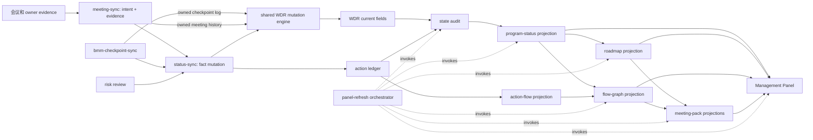
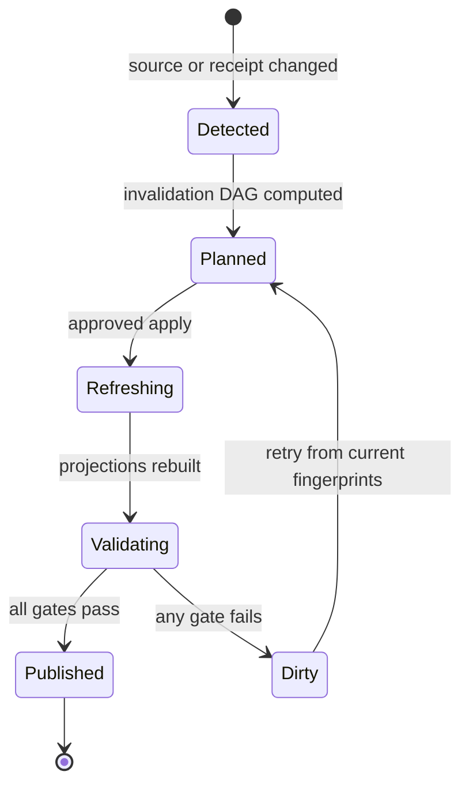

# Architecture Spine - ADP Management Panel 状态同步

## Design Paradigm

采用 CQRS 风格的单向状态传播：owner workflow 通过 typed command 修改事实，read-side producer 生成 materialized projection，Management Panel 只校验和组合 projection。系统不采用 event sourcing；Markdown/JSON fact files 与 receipts 仍是 durable state。



## Invariants & Rules

### AD-1 - 事实 surface 只有一个 mutation engine

- **Binds:** meeting-sync、status-sync、bmm-checkpoint-sync、risk-dependency-change-review、workstream-register、WDR、action ledger、Management Panel
- **Prevents:** 同一 action 或 WDR 字段被多个 workflow 以不同语义修改。
- **Rule:** `adp-status-sync` 独占 action ledger、fact-bound `action-flow.json`、全部WDR current fields和Roadmap；meeting/checkpoint/risk只能提交typed status intent，由status-sync验证后以自己的capability发出WDR command。meeting仅直写Meeting Sync History，checkpoint仅直写Checkpoint Sync Log，risk review仅直写risk-flow与decision fact；risk的直接事实写入只能使用`owned-fact-command/1.0.0`，由raw registry allowlist唯一导出producer、operation、memory root、exact/path-rule target和JSON-schema或canonical-Markdown content rule，wrong producer/path/root/schema、extra target或stale CAS均拒绝。所有physical WDR bytes仍只能由shared engine写。serialized issuer及wire graph内嵌capability不授予权限；runtime在fact lock内从registry注册路径加载canonical raw capability-registry bytes，并把OS边界单独提供的host principal作为第二个非wire authority输入，普通mutation、recovery与repair都必须使用同一authority。engine验证active capability epoch及typed command实际operation/fields/section全覆盖。strict mode不接受capability create/rotate/revoke runtime command；任何lifecycle请求必须返回`CAPABILITY_LIFECYCLE_REQUIRES_ROLLBACK`，先经registered activation transition回退legacy并递增epoch，再由reviewed bootstrap reprovision、full refresh和新attestation重启strict。每个fact transaction只绑定一个typed command；所有projection-relevant fact commit都由fact-transaction-coordinator journaled并递增fact generation。journal、receipt与fact proof交叉绑定active capability registry/record digest、authorized command fingerprint、producer/capability/epoch/principal、command-derived exact root/path/operation/CAS，以及每个business target的base64 before/after raw bytes和schema-valid fact state。action validator必须从exact before ledger解析21列row、执行command create/patch、重渲染exact after ledger并重建ledger state/action-flow，逐字节比较三个after images；任何mutable field回绑、omitted-field reset、terminal reopen或derived state/flow不一致都拒绝。action command只写ledger、ledger state、action-flow index并产生per-action revision delta；WDR Next actions由后续独立有序`refresh_actions` transaction更新且不得产生action delta。Panel与refresh producer不修改事实。

### AD-2 - Action mutation 使用版本化 command

- **Binds:** meeting-sync sync plan、status-sync batch contract、action ledger
- **Prevents:** owner-only 更新把 status 重置为 `open`、旧会议覆盖新状态、更新被误注册为新 action。
- **Rule:** action command v2必须携带stable `command_id`并显式声明`operation: create|patch`；create也携带exact `action_id`，显式ID优先，否则按pinned evidence/scope/action hash算法确定，collision fail closed。action `routing_scope_id`可为physical workstream或`program`，WDR target仍只允许physical ID。canonical ledger保留brownfield 20列并追加独立`Action Revision`为第21列；legacy 12/20列adapter只补缺失metadata和revision，不得丢失lifecycle/baseline/relation数据。create的source/reason/created/updated/lifecycle timestamps/default cells与row order由protocol确定。patch携带exact ID、expected revision、presence-preserving非空`set`与evidence；omitted永不应用v1 default，evidence最大`observed_at`不得早于现有Last Updated。before/after row都必须满足Created/Started/Done/Cancelled/Last Updated的完整时间线顺序及status对应关系；`done|cancelled`不得重开，合法status transition按pinned timestamp规则更新。offset/fraction timestamp先规范成UTC整秒再进入command/action identity；相同command ID+fingerprint重放为no-op，不同fingerprint冲突。

### AD-3 - WDR mutation 使用 typed patch

- **Binds:** meeting-sync `wdr_update`、status-sync、WDR schema
- **Prevents:** 会议文字已追加但 `Progress`、`Blockers`、`Risks` 等 current fields 仍旧。
- **Rule:** shared engine只接受`wdr-command/1.0.0`。create command内嵌schema-valid logical input；engine重算input ID、核对workstream ID，并用pinned placeholder renderer自行重渲染后再验证canonical bytes/hash，不读取out-of-band input。create在一个fact transaction中原子创建WDR、WDR state与schema-valid空action sidecar，revision/generation均从`1/1`开始，不允许留下无法进入physical inventory的孤立WDR。template现有required sections必须存在，Roadmap/Checkpoint/Meeting sections可缺。首次patch把现有status/checkpoint writer产生的legacy section order byte-preserving迁到canonical subsequence，并固定缺失Last status sync/optional section插入位置。patch携带expected WDR revision/file generation；counter从actual before/after bytes重算：no-op不提交，任意bytes变化只令file generation +1，只有Identity/Project Status current signature实际变化才令WDR revision +1，history-only不推进WDR revision；一个mixed command最多各递增一次。一个outer command可以追加多个Meeting History rows，但每个row的inner `command_id`必须逐字节等于outer command ID；current change的evidence不得早于现有Last status sync，duplicate section/meeting key阻断。current fields只接受status-sync capability；ledger-backed Next actions只能由`refresh_actions`重建。普通和repair refresh都必须在同一fact lock内读取registry固定的exact ledger/ledger-state bytes，重建active且routing-scope或affected-workstream命中的完整snapshot，并把两项read preimage绑定proof；snapshot、fingerprint、ledger revision或membership不一致均拒绝。该operation只修改WDR、WDR state和action sidecar，不修改ledger/action revision。

### AD-4 - Projection freshness 由 live source fingerprint 决定

- **Binds:** state-audit、program-status、roadmap、flow-graph、meeting-pack、Management Panel
- **Prevents:** 内容完整且 artifact audit 合法、但源 WDR/ledger 已变化的旧 projection 继续发布。
- **Rule:** 每个canonical projection都有schema-bound payload envelope、immutable projection、manifest和producer receipt，列出leaves、same-generation upstreams、root/blob IDs与`affects`；physical leaf identity只允许`(root_instance_id,path)`，同path metadata冲突拒绝，所有enumerator有portable hidden/symlink/optional/recursive/error语义。7个producer read profile、7个payload schema binding与envelope kind必须逐项相等；runner逐binding校验root/path/raw hash/pointer。锁内`physical-workstream-inventory-v1`独立枚举全部one-level WDR及exact action sidecar，验证完整WDR grammar、sidecar registered contract与canonical bytes，并拒绝hidden/nested/unpaired/invalid/duplicate/empty；fresh attestation另绑定memory root、fact generation、完整rows、inventory ID与attestation ID。selection policy的inventory与content-addressed catalog必须逐字节等于fresh attestation rows，generation中的全部WDR/action-sidecar leaves也必须与其双向相等，`all`只能在闭包通过后解析且结果非空。generation另绑定registry-derived Panel binding catalog。registered Program Status validator必须从selected exact WDR bytes与schema-valid active WDR states重新解析Identity/Project Status/Next actions，逐字段生成`workstream_current`的phase/status/progress/blockers/risks/dependencies/action IDs及WDR fingerprint/revision/generation；payload rows必须逐字节等于该结果，旧row carry-forward或WDR-only变化未传播都拒绝。Program Status的progress-v3/flow-state-v1仍完整校验。Panel v2是加法升级，在`model_v1`无损保留pinned v1 model/manifest、三类view、scenario flows、history、selection/catalog/recovery与keyed boards，在`sync.canonical`并列携带所有canonical payload。pinned v2 consumer经instrumented resolver必须按序只读`/sync/canonical/status/workstream_current`与`/panel_id`，actual read set恰等于registry declaration并禁止`model_v1`；current-only变化必须可见、HTML必须转义、legacy-only变化不得影响current view。`model_v1`必须由同generation canonical payload、compatibility inputs与pinned composer重组，并通过baseline/current-independent/overlay-change/tamper四场景完整model corpus，不得沿用旧current view。每个outer/nested binding、payload/envelope hash、manifest、receipt和same-generation linkage都在receipt前验证；Panel另逐registry binding比较同generation upstream envelope value、merge key及独立推导的exact producer/instance cardinality。instrumented resolver强制`actual reads == registry-derived allowed reads`；state-audit不再读取mutable current views，derived readiness也不是leaf。Panel refresh/inspect重算全部live leaves和fresh inventory attestation；inventory/catalog、audit、drift、canonical IDs、manifests与receipts必须完全覆盖同一个policy/generation；missing/unverifiable/mismatch均不得报告`fresh`，且只有audit pass/ready、fresh与selected drift全`in-sync`时publication eligibility才可为`eligible`。

### AD-5 - WDR action projection 具有可验证的 split ownership

- **Binds:** action ledger、WDR `Next actions`、state prepass、state audit
- **Prevents:** active action 遗漏、terminal action 残留、同 ID 的 owner/text/due 已漂移，以及空 ledger 时漏检。
- **Rule:** `workstreams/<id>/action-projection.json` 是status-sync拥有的durable sidecar，不是refresh DAG output。WDR create在其fact transaction中原子创建schema-valid空sidecar；后续由独立且按action transaction之后排序的`refresh_actions` fact transaction与WDR/WDR state一起replace。action ledger transaction只写ledger、ledger state与action-flow index，绝不写该sidecar。sidecar按 pinned schema保存 ledger fingerprint、structured active records、revisions/generation、renderer ID/hash与summaries。managed summary的owner/action/due按UTF-8 RFC 3986 uppercase percent encoding并经decode/re-encode逐字节验证；refresh只替换按action ID排序的managed marker，完整保留manual entries，拒绝malformed/noncanonical/duplicate marker。WDR collection的reserved empty sentinel与其escaped literal item必须无损区分。drift producer必须从profile直接读取ledger/ledger-state、sidecar、WDR/WDR-state，按active status与routing-or-affected membership重建expected snapshot，再比较ledger fingerprint/revision、missing/extra IDs、每个完整record、WDR lineage和parsed Next actions。所有差异统一输出typed `driftFindingV1`，`finding_id=SHA256(JCS(body excluding finding_id))`；action missing/orphan/content diff为repairable并携带typed action diff，ledger/WDR lineage类差异为non-repairable但仍保留。state-audit必须复用同一raw finding和ID，不得另造literal ID或丢弃非action finding。空active set仍检查。verdict必须逐字节等于重算结果，selected IDs与workstream rows集合完全相等且无重复，只有非空全覆盖且所有selected row均`in-sync`时overall才可`in-sync`；producer自报status/finding的false-green verdict阻断publication。scope外 drift为degraded并进入repair queue。

### AD-6 - Refresh 是显式 invalidation DAG

- **Binds:** panel refresh entry point 和所有 projection producer
- **Prevents:** writer 隐式级联导致失败边界混乱，以及用户手工猜测需要重建哪些层。
- **Rule:** orchestrator按registry DAG/profile计算invalidation，在shared read lock内以每个leaf同一次read生成hash+blob并冻结generation。DAG展开为`(projection_kind,instance_key)`节点，resolved leaves也是source节点；任一projection instance或leaf identity变化后，按topological order重算direct input map并传播，实际direct/transitive invalidated instance set必须逐项等于registry闭包。meeting-pack单实例变化不得污染sibling，只校验kind-level edge或只失效一层不合格。所有node只写generation staging/immutable outputs。generation、projection kind、null/non-null instance与transaction IDs必须使用registry固定的`h_<generation-hex>|i_<sha256(UTF-8 id)>|singleton` token；canonical projection与Panel immutable路径只能由registry templates解析，pointer中的任意自选路径、alias或redirect都拒绝。同generation的state-audit、program-status、roadmap、meeting-pack、Panel、refresh receipt及任何携带`source_as_of`的document必须逐字节等于selection policy `as_of`，不得改用完成时间、当前时间或max mtime。发布前重新持fact read lock复验leaf map、fact generation、selection/catalog、fresh physical inventory attestation、producer receipts、exact producer cardinality、Panel bindings与drift；保持该锁再取得panel lock，把全部canonical projections、Panel、current pointer、panel state和publication receipt放入一个journal，以panel generation CAS切换。publication graph显式携带schema-valid before/after pointer与panel state并将完整bytes绑定target CAS，所有projection/Panel/pointer/state/receipt路径从registry读取。首次publication只允许pointer和panel state同时absent、两个target同时`create`且after generation为1；后续两者必须同时存在并`replace`为generation+1，单边缺失、synthetic generation-0或create/replace混用均拒绝。meeting-pack按`scenario` object-by-key合并，禁止last-write-wins。source/panel冲突typed fail closed，所有current views/pointer共同前进或共同回滚。

### AD-7 - Audit finding 必须可机器修复

- **Binds:** state-audit JSON/Markdown、status-sync repair workflow
- **Prevents:** finding canonicalization 丢失 action ID，批量修复只能重新解析自然语言。
- **Rule:** audit finding v2从validated drift verdict逐项无损投影，保留相同content-addressed finding ID、typed workflow/workstream/operation、entity refs、exact action IDs、source line与nullable `repair_batch_id`；non-repairable ledger/WDR finding使用null batch但仍保留，action finding必须进入唯一batch。每个finding中action-typed entity ref IDs必须无重复、NFC canonical且逐项等于`action_ids`。sort key包含finding ID，group key只含前三项；repairable finding全局唯一且恰好属于一批。registered repair-graph validator按dry-run batch ID精确查找audit batch，要求finding/batch双向链接、audit ID、finding union/command/read-set action IDs、唯一WDR/source reads及command/WDR revisions完全相等，并从wire documents重算所有identity；不接受out-of-band binding preimage。dry-run在fact lock内打开registry-derived exact ledger/ledger-state、WDR/WDR-state与sidecar bytes，验证canonical ledger state，并由实际rows推导每个action的presence/revision及同一snapshot的typed drift；self-claimed orphan、wrong revision、invented diff或drift substitution在签token前拒绝。它分别验证dry-run blocked无token或journal、committed的`unused->reserved->consumed`图，以及reserved后`invalidated`+business rolled-back marker+recovery receipt图。applicable repair先以business journal提交或恢复business/fact-generation/fact-command-index/nonce/fact-receipt，再以独立且必须committed的repair-attempt journal原子追加attempt ledger与repair receipt index并创建repair receipt；两个journal不得交换targets。attempt identity由business transaction/journal及实际terminal marker、optional recovery receipt的ID/raw hash做JCS hash确定，repair receipt/index/attempt ledger携带同一handoff；fresh process必须能在business marker后和每个attempt target边界从registered paths幂等roll forward，且只产生一个attempt sequence。两批partial retry必须执行三个完整wire graph：A两事务commit保留、B stale-CAS后business rollback但attempt commit记录失败、restart后按registered index/ledger skip A且从current facts用新token/rebound read set重试B。committed `refresh_actions` repair必须取得与普通mutation相同的外部raw capability bytes与OS principal，并携带typed WDR command、fact before/after state和byte proof，先复用普通fact attribution validator；business targets恰好是WDR、WDR state与action sidecar，fact receipt action deltas为空。ledger不存在的orphan用`expected_present=false, revision=null`且必须由exact ledger bytes证明。`issued_at <= applied_at <= expires_at <= issued_at+15m`，nonce与fact receipt绑定business transaction。

### AD-8 - Integrity 与 freshness 分开报告

- **Binds:** Management Panel refresh、inspect、manifest、用户输出
- **Prevents:** “artifact 未损坏”被误解为“业务状态最新”。
- **Rule:** schema-valid Panel payload记录生成时的`artifact_integrity`、`business_freshness`、`publication_eligibility`与`source_as_of`；前三者由独立semantic validator关联，不能靠各字段分别schema-valid来宣称可发布。immutable refresh-run receipt逐node表达planned/reused/refresh/produced/pending/blocked、原因、optional output和retry cursor；blocked producer不得伪造output ID。运行态last success、pending invalidations和latest inspect只写mutable `state/panel-refresh-status.json`，不进入content identity。静态`file://` Panel不声称自行发现源变化；open/refresh前先live inspect。

### AD-9 - Legacy 输入 fail-visible

- **Binds:** schema migration、meeting-sync、status-sync、Panel refresh
- **Prevents:** 旧自由文本被猜测成 destructive mutation，或缺 provenance 的旧 projection 静默通过。
- **Rule:** legacy action带`action_id`按patch，无ID才按create；v1 source artifact、alias precedence、raw presence、program routing、UTC-second normalization、action/command ID算法均pinned。legacy `wdr_update` free text只能生成history/evidence；只有输入另带schema-valid additive typed status payload时才生成intent，否则显式报告`LEGACY_STATUS_INTENT_REQUIRED`且current mutation为零。缺manifest/profile instrumentation或尚未接入fact fence的writer都使strict Panel返回`migration-required`。

### AD-10 - Mutation 与 refresh 使用分离且明确的事务边界

- **Binds:** meeting-sync、status-sync、bmm-checkpoint-sync、WDR engine、refresh orchestrator
- **Prevents:** 事实已更新但下游失败时误回滚或误报，以及不同实现对多command失败采用隐式跨事务回滚或不同retry起点。
- **Rule:** fact、repair、repair-attempt与Panel publication都用pinned journal/state schemas及registered journal semantic validator。journal目录精确等于`state/transactions/{filesystem-token(transaction_id)}`；validator按transaction kind强制完整role集合。每个target固定role、operation、从0连续且唯一的整数apply order、唯一physical target identity、before/after hash，以及逐字节位于本journal目录的root/hash一致image locator；integer order数值比较，11-target journal仍保持`...8,9,10`。foreign/parent-alias locator拒绝。create/replace/remove的image nullability固定，receipt path必须精确对应role=receipt target及registry runtime path。fact与Panel各一份receipt；repair业务journal只含fact receipt，独立repair-attempt journal只含repair receipt并同时更新repair-attempt ledger与repair receipt index。manifest/marker identity和引用均重算；`committed`证明成功，`rolled-back`只证明recovery已恢复该transaction的before，prepared不是终态。无marker时all-after roll forward、混合状态逆序恢复before、unknown bytes corrupt。absent-target rollback使用`durable_remove_to_tombstone`，commit前保留tombstone；POSIX/Windows分别固定create/replace/remove与flush边界。meeting plan的status intents必须与dedicated carrier commands形成exact双向闭包，即使zero history也必须提交intent-only fact transaction；risk-flow及decision owned-fact command只要携带intent都按presence-driven规则emit。meeting/checkpoint/risk的producer command必须携带exact typed `status_intents`并在同一fact journal向outbox逐项追加canonical bytes/hash，禁止从history或producer identity合成payload。outbox只允许`pending|consumed`，failed/waived数组必须为空，任一pending都阻断Panel。status-sync把同workstream accepted intents合并为恰好一条WDR patch；patch携带全部sorted content-hash `consumed_intent_ids`，同一journal prefix-preserve无关outbox rows并将完整pending same-workstream set共同绑定fact receipt转为consumed，missing/extra/terminal/cross-workstream或子集消费均拒绝。batch固定`action commands by command_id`后接`WDR patches by (workstream_id,command_id)`；split same-workstream patch在执行前拒绝。每条command独立预检与提交，首错停止，已committed前缀不回滚，retry cursor为第一个缺matching committed receipt的command并从当前facts重新读取。Refresh不回滚facts。

### AD-11 - Contract registry 是唯一 wire truth

- **Binds:** 所有 mutation、projection、audit、refresh producer/consumer
- **Prevents:** 两个实现用相同版本号生成不同字段 shape、canonical bytes、renderer 或兼容行为。
- **Rule:** `contracts/CONTRACT-REGISTRY.json`的raw bytes是唯一registry authority，固定67个schema contracts、23个source pins、9个enumerators、7个profiles、7个payload bindings、4个nested bindings、6条Panel source bindings、15条DAG edge、56条typed RFC6901 array ordering、20条identity-set field ordering、3条semantic sequence rules、60个runtime paths、4个owned-fact target profiles、8条source-time bindings、21类semantic validator及protocol/harness hashes；producer自报status不具authority。每个document在shape parsing前以registry record与loaded raw hashes递归验证全部embedded contract refs；hash-shaped字段本身不构成协商。identity使用RFC8785 JCS；string key要求NFC UTF-8序，integer key数值排序，pinned v1小数按完整JCS保留，安全整数越界、非有限number、lone surrogate及normalized collision拒绝。两套reference harness按registry exact ID/algorithm/ordered scope取得handler，真实执行每行，并要求executed/registered/handler ID集合相等；另执行全部enumerator、leaf/instance DAG closure、exact traced read set、typed ordering、bootstrap migration、owned-fact allowlist/byte proof/recovery、receipt-derived activation lifecycle prefix CAS、durable release-evidence history transition、non-candidate trusted evaluation time/expiry、production/design trust-domain隔离、全部source-time carriers与first-publication direct/fresh-process replay、restart-safe exact lineage descriptor closure、full live inspect root/ledger/WDR/sidecar/receipt/read-set/root-instance/cardinality closure、WDR inner/outer command binding、21列action mutation/terminal/chronology、WDR counter/marker/history encoding、zero-history meeting/risk-decision carrier、producer-bound exact intent emission与完整aggregate消费、pending-only convergence、normal mutation后N+1 fresh inspect、typed drift-to-audit round trip、ledger-derived repair reads、deterministic attempt handoff/fresh-process recovery、WDR-current/drift、immutable paths、Panel v1/v2 consumer、fact proof/journal/executed grouped repair双事务restart/release反例。当前669个唯一design vectors必须零失败。receipt仍明确是`design-fixture-check`且native durability=false。release gate要求完整suite、零失败、hash/result ID一致、至少两个不同implementation ID且build IDs也全不同、native POSIX真实fault injection及native Windows CI；production registry不得内置trust root，provision须reviewed update且至少两root，design-mock roots不能授权production。registry在这些生产证据通过前保持`implementation_conformance_status=pending`。

### AD-12 - Strict publication 由迁移与生产证据双门禁

- **Binds:** runtime bootstrap、writer migration、Panel open/inspect/publish、production rollout
- **Prevents:** 未迁移writer或design-only harness被误当作强freshness生产能力，以及本地rollback把旧generation重新标成current。
- **Rule:** 部署保持现有local CLI/file模式，不引入新service/provider。首次迁移在一个mixed create/replace fact journal中接受absent、pinned legacy 12列或brownfield 20列ledger，保留全部旧字段、追加Action Revision、迁移legacy Meeting Sync Update、生成brownfield-compatible action-flow以及每个WDR state/action sidecar；commit后重复写拒绝，exact retry幂等。strict mode只有在raw registry implementation conformance=`passed`、`state/strict-activation.json`为strict且当前epoch的完整writer-fence attestation有效时才可启动和发布。attestation的`binding_scope=immutable-writer-fence`只授权root、schema/registry、release authority、capability epoch与authoritative writer build/fence/capability coverage；其中保留的fact/ledger/WDR/refresh/pointer/lineage/Panel snapshot字段仅为诊断，不作为后续正常mutation的授权前像。release acceptance、release transition、strict open/inspect/publication都必须从host security context取得非candidate控制的`host-secure-clock-v1` evaluation time，并在当次评估复验Python support-review deadline、trust-root有效期和release-set chronology；时钟不可用不能沿用旧green。accepted production receipts与全部evidence blobs先写registry-derived content-addressed paths，再通过`before generation/set CAS -> archive create -> current replace -> history-index replace -> transition receipt create`的journaled release-evidence transition发布；history必须从generation 1连续并支持fresh-process commit/rollback recovery，unindexed、extra、missing或redirected bytes都拒绝。strict activation只允许`rollback -> reprovision -> record-refresh -> attest -> enable`五个连续、各自journaled且CAS-bound的registered transition；每步journal除operation-exact business target与receipt外还必须create/replace同一registry-derived lifecycle index，entry从该步committed receipt ID/path/raw hash导出，before index必须逐字节等于上一commit的after prefix，只有enable可标记terminal enabled。forged entry、disconnected preimage、wrong order/authority/path/operation均拒绝，fresh-process recovery必须一起恢复business/index/receipt且不得跳步。restart-safe live inspect必须重新加载activation state/attestation、raw capability registry、durable release-evidence history/current set及每份receipt/blob、pointer、lineage index及全部immutable lineage objects和live facts；attestation绑定set ID而不是进程内result列表。当前mutable fact generation、ledger/state/action-flow、全部WDR/state/sidecar、latest refresh/publication receipts、pointer/panel与lineage descriptor必须在fact read lock内从live bytes和receipt/CAS链重新验证，并在kind/contract/root/path/instance/cardinality上exact全量相等。普通fact变化只把当前Panel判为stale并进入refresh；它可以在同一activation epoch发布generation N+1，再由fresh process返回fresh，不能要求reprovision。activation rollback/epoch mismatch、attestation replacement、capability epoch drift、writer build/fence bytes变化、pending registry或design-only evidence返回`migration-required`；mutable lineage/fact漂移则按live verdict fail-visible，二者不得混淆。rollback切回legacy并递增activation epoch，使旧attestation立即失效；只有immutable writer-fence authority变化才要求在新epoch重新走五步激活。当前raw registry为`pending`且production trust roots为空，因此本设计包不授权production strict publication。

## Consistency Conventions

| Concern | Convention |
| --- | --- |
| Stable identity | Action create携带exact ID；无显式ID时按pinned evidence/scope/action hash算法生成，兼容`ACT-*`与legacy `A-FLOW-1`；finding使用`finding_id`；projection/panel使用content identity。 |
| Mutation envelope | `schema_version`、`operation`、target ID、expected revision、partial `set`、evidence；omitted 与 empty 是不同语义。 |
| Time | Legacy offset/fraction RFC3339先转UTC并向下截到整秒；durable wire只写`YYYY-MM-DDTHH:MM:SSZ`；同generation所有`source_as_of`逐字节等于selection policy `as_of`；release/open/inspect/publish的evaluation time来自独立host可信时钟，candidate时间只参与chronology。 |
| Fingerprints | leaf 使用同一次 raw-byte read产生 immutable blob与SHA-256；structured identity使用RFC8785 JCS；resolver使用root ID且在POSIX拒绝symlink、Windows拒绝reparse point，并拒绝absolute/dot/case/Unicode alias。 |
| Errors | Contract violation 和 stale revision 为 blocked；projection drift 默认 blocked 或 degraded 由是否影响当前展示决定；不得自动吞掉。 |
| Publication | Fact mutation 与 projection refresh 是两个 receipt；mutation 在 shared lock 内 CAS；refresh 以 immutable generation 构建并在同一 lock/fact-generation/panel-generation fence 内完成 final compare + publish CAS。 |
| Idempotency | command ID 建立 durable receipt index；相同 ID + payload fingerprint 重放为 no-op，不同 fingerprint 冲突；相同有效输入保持相同 projection/panel identity。 |

## Contract Seed

Normative artifacts（raw bytes，不接受等价重排）：

| Artifact | ID | SHA-256 |
| --- | --- | --- |
| `contracts/CONTRACT-REGISTRY.json` | `urn:adp:panel-sync-contract-registry:1.0.0` | `ac72ae177a858390d1e7489735f1a817fac0657093b971ca65625c27a552fa10` |
| `contracts/panel-sync-contracts.schema.json` | `urn:adp:panel-sync-contracts:2026-07-24` | `513d7232e59d50173fc8ef294ddb596d5f17306191ba171be8eaafd67d961a27` |
| `contracts/WDR-AND-TRANSACTION-PROTOCOL.md` | `urn:adp:wdr-action-renderer:1.0.0` | `f1de3e7a6c41b45a695494510414dc1e4b01fd03597fccf5aa1d2f012cf8ebe2` |
| `contracts/fixtures/CONFORMANCE-VECTORS.json` | `urn:adp:panel-sync-conformance:1.0.0` | `2a7a2374bd896aff950850185462e84239385fa4183bc1ff93b0c358f11208cc` |
| `contracts/fixtures/PANEL-V1-COMPATIBILITY.json` | `management-panel-v1-compatibility/1.0.0` | `3b96b7806e3027df17f12cc48668d13980245dc9fb34fcb8a226525a962b6fe7` |
| `contracts/conformance/python_runner.py` | `python-reference-adapter/1.2.0` | `fd438f049cb05d3b993d9422af8a18d9415365318be5e2c4703c44e15c4eb96f` |
| `contracts/conformance/node_runner.mjs` | `node-reference-adapter/1.2.0` | `4841f86e4c8545b0fa3011cb7d8b9954d60cf7b0eacfd71435a0228b14d8b7f6` |
| `contracts/conformance/panel_v2_consumer.mjs` | `management-panel-v2-current-consumer/1.0.0` | `eaf497fbf79eaedface1408b1ea1679aec7d7e85709fd9e3a386550855bbc423` |

Design fixture evidence（result绑定registry hash，但result raw hash不写回registry，避免hash cycle）：

| Implementation | Platform | Result | Vectors |
| --- | --- | --- | --- |
| `python-reference-adapter` | POSIX design model | `contracts/conformance/python-result.json` (`7d49dde92276f37d2fef298567d4990236a3d4539442190f743ee807c6abdbec`) | 669 passed, 0 failed |
| `node-reference-adapter` | POSIX design model | `contracts/conformance/node-result.json` (`e8d6e05193f0ae170f6d091cced10cd262da826ecdf9e5e8536110fd25485bce`) | 669 passed, 0 failed |

两份receipt均为`design-fixture-check`且`native_durability_exercised=false`；它们不满足production implementation gate。

| Contract | Version | Producer | Compatibility rule |
| --- | --- | --- | --- |
| meeting sync plan | 2.0.0 | adp-meeting-sync | 仅 registry 点名的 v1 ingress adapter；v2 writer 不向 v1 reader 直写 |
| status mutation intent / status sync batch | 1.0.0 / 2.0.0 | meeting/checkpoint/risk -> status-sync | current fields由status-sync重新授权并发command；origin workflow不直接写 |
| owned fact command | 1.0.0 | risk-dependency-change-review | 仅registry allowlisted risk-flow/decision target、content contract与create/patch；复用普通fact fence |
| WDR command/file state | 1.0.0 | shared WDR mutation engine | legacy revision/generation为0；create原子创建空sidecar，后续`refresh_actions`与WDR state/sidecar同事务 |
| action ledger mutation | 2.0.0 | adp-status-sync | legacy row 缺 `Action Revision` 时读取为 1，写回时升级 |
| WDR action projection fact sidecar | 1.0.0 | adp-status-sync | WDR create原子创建空sidecar；后续仅`refresh_actions`替换，action transaction不写；保留unmarked manual entries |
| projection dependency manifest | 1.0.0 | all canonical producers | legacy `source_fingerprints` 不具备 live-freshness 证明力 |
| generation/producer/drift receipts | 1.0.0 | panel-refresh/state-audit/producers | same-generation handles与required drift gate |
| audit finding/repair | 2.0.0 | adp-state-audit | v1 fields 保留，v2 additive entity/repair fields |
| repair dry-run/apply/run | 1.0.0 | status-sync | per-batch typed read set与single-use token；business repair与append-only attempt audit使用两个独立journal |
| runtime/journal/pointer state | 1.0.0 | bootstrap/coordinators | bootstrap、filesystem token、first-create与recovery均pinned |
| fact/panel publication receipts | 1.0.0 | mutation engine/panel-refresh | journal含receipt target；receipt不自引用 |
| refresh run receipt / panel refresh status | 1.0.0 | adp-panel-refresh/inspect | per-node optional output与retry cursor；mutable status不进入Panel identity |
| release evidence/history transition | 1.0.0 | release gate | generation/set CAS、content-addressed archive、current/history/receipt同journal，trusted evaluation time重验expiry |
| activation transition command/receipt | 1.0.0 | activation administrator | rollback、reprovision、record-refresh、attest、enable按序且operation-exact target/recovery |

## Stack

| Name | Version |
| --- | --- |
| Python | production runtime `>=3.10,<4.0`；3.9拒绝、3.10接受由release vectors固定，production receipt必须记录exact interpreter/build并通过native conformance |
| Node.js | production只接受major `22`或`24`；23、25及其它major即使落在数值区间附近也拒绝 |
| JSON Schema | Draft 2020-12 + pinned schema bundle |
| Canonical JSON | RFC 8785 JCS；safe integers + pinned-schema finite fractions |
| Durable filesystem adapter | POSIX + Windows contract；capability不足时apply fail closed |
| Markdown fact records | existing ADP schemas |
| Self-contained HTML Panel | brownfield model 1.0.0 pin + target payload 2.0.0 |

## Structural Seed

```text
skills/
  adp-meeting-sync/       # evidence classification and mutation-intent producer
  adp-status-sync/        # action single writer and recurring-status coordinator
  adp-bmm-checkpoint-sync/# status-intent + owned checkpoint-log producer
  adp-risk-dependency-change-review/# status-intent + risk-flow/decision owner
  adp-workstream-register/ # WDR create command producer
  adp-fact-transaction/    # all canonical-memory fact targets, generation, journal, capabilities
  adp-wdr-mutation/       # shared section-aware WDR patch/CAS engine
  adp-state-audit/        # live-source, drift, and repair-plan validation
  adp-panel-refresh/      # invalidation planner/orchestrator; no fact ownership
  adp-management-panel/   # audited read-model composition and publication
```



## Capability -> Architecture Map

| Capability / Area | Lives in | Governed by |
| --- | --- | --- |
| Existing action owner/status mutation | meeting-sync + status-sync | AD-1, AD-2 |
| WDR current-field update | meeting/checkpoint/risk intent -> status-sync -> WDR engine | AD-1, AD-3, AD-10 |
| Panel live-source validation | state-audit + management-panel | AD-4, AD-8 |
| Ledger/WDR drift alert | prepass + state-audit | AD-5, AD-7 |
| Batch repair by action ID | state-audit + status-sync | AD-7, AD-10 |
| Quick/full Panel refresh | panel-refresh orchestrator | AD-4, AD-6, AD-8 |
| Backward-compatible rollout | all affected contracts | AD-9, AD-12 |

## Deferred

- 完整 Action Center 或第四种 Panel view：本轮不改变已冻结的信息架构。
- 实时 push、文件 watcher、消息队列或后台 daemon：当前显式刷新和 open 前 live inspect 足够；出现明确时延 SLO 后再评估。
- 把 Markdown fact store 迁移到数据库：现有原子写和 receipt 模型可承载本轮目标。
- 从自由文本自动匹配 existing action：误匹配会产生 destructive mutation；等待独立 entity resolution 设计。
- Shareable immutable archive 的离线 live-source 验证：归档只证明生成时 lineage 和完整性，不承诺打开时仍是 current。
- `source-to-projection lag`、`projection-to-panel lag`及量化freshness SLO：先定义authoritative clock、retention窗口、暂停/重试计时和SLO breach语义后再绑定阈值；当前只报告确定性的pending invalidation、drift和refresh outcome计数。
