# AI Delivery PMO 模块说明

AI Delivery PMO（ADP）是一个面向复杂交付项目的 BMad 模块，用来协调多条 FDE 工作线的状态、风险、依赖、证据和验收准备度。它不替代 BMM：每条工作线仍然用 BMM 完成 PRD、架构、Story、实现和验证；ADP 只在项目层维护统一的同步面。

ADP 的核心对象是 **Workstream Delivery Record（WDR）**。WDR 不复制完整 PRD 或架构内容，只记录项目管理所需的摘要、路径、风险、依赖、决策、证据、readiness 缺口和下一步动作。

## 模块流程图

图中每个关键节点都标出了建议使用的 skill。为了避免回环线穿越整张图，所有返工都收敛到“返回阶段 1”的连接器节点；执行含义是回到工作线推进，但图上不再画长距离回头线。

```mermaid
%%{init: {"flowchart": {"curve": "basis", "nodeSpacing": 48, "rankSpacing": 68}}}%%
flowchart LR
  classDef setup fill:#eff6ff,stroke:#2563eb,color:#0f172a,stroke-width:1px
  classDef bmm fill:#f5f3ff,stroke:#7c3aed,color:#0f172a,stroke-width:1px
  classDef adp fill:#f8fafc,stroke:#64748b,color:#0f172a,stroke-width:1px
  classDef lead fill:#ecfdf5,stroke:#16a34a,color:#052e16,stroke-width:1px
  classDef decision fill:#fff7ed,stroke:#f97316,color:#0f172a,stroke-width:1px
  classDef loopback fill:#fff1f2,stroke:#e11d48,color:#881337,stroke-dasharray:5 4

  subgraph S0["0. 模块启动"]
    direction TB
    SETUP["安装或更新 ADP 模块<br/>skill: adp-setup"]
    KICKOFF["项目启动与共享记忆初始化<br/>skill: adp-project-kickoff"]
    REGISTER["登记每条工作线并创建 WDR<br/>skill: adp-workstream-register"]
    SETUP --> KICKOFF --> REGISTER
  end

  subgraph S1["1. 工作线推进与项目状态沉淀"]
    direction TB
    BMM["FDE 推进 BMM 生命周期<br/>BMM skills: bmad-prd / bmad-architecture / bmad-create-story / bmad-dev-story / bmad-tea"]
    CHECKPOINT["BMM 关键节点同步到 ADP<br/>skill: adp-bmm-checkpoint-sync"]
    STATUS["日常轻量状态同步<br/>skill: adp-status-sync"]
    L0SYNC["L0 约束、门禁、NFR、证据规则同步<br/>skill: adp-l0-reference-sync"]
    STATE["ADP 共享状态更新<br/>WDR / evidence / decisions / readiness"]
    BMM --> CHECKPOINT --> STATE
    BMM -. owner update .-> STATUS --> STATE
    L0SYNC --> STATE
  end

  subgraph S2["2. 项目级视图生成"]
    direction TB
    LEAD["读取全局状态并生成判断<br/>skill: adp-agent-program-lead"]
    VIEWS["项目级视图包<br/>项目负责人视图 / FDE action list / readiness view / 周报"]
    RISKVIEW["风险矩阵与依赖图<br/>skill: adp-risk-dependency-change-review"]
    READYVIEW["验收与切换 readiness<br/>skill: adp-acceptance-readiness-review"]
    BIZMAT["双周业务例会材料<br/>skill: adp-agent-program-lead"]
    LEAD --> VIEWS
    LEAD --> RISKVIEW
    LEAD --> READYVIEW
    LEAD --> BIZMAT
  end

  subgraph S3["3. 例会、沟通与决策闭环"]
    direction TB
    MEET["FDE 内部 1/3/5 例会<br/>输入: 项目级视图包"]
    MSYNC["会议和线下沟通留档<br/>skill: adp-meeting-sync"]
    CLASSIFY{"问题或决策归类"}
    FDEDEC["FDE 内部可决策<br/>skill: adp-meeting-sync<br/>风险/变更时: adp-risk-dependency-change-review"]
    PACKET["业务问题包<br/>skill: adp-risk-dependency-change-review<br/>或 adp-meeting-sync"]
    BIZMEET["业务沟通或双周业务例会<br/>会后同步: adp-meeting-sync"]
    CLOSEITEM["回写 daily log / decisions / WDR / action<br/>skill: adp-meeting-sync 或 adp-status-sync"]
    RET1["返回阶段 1<br/>继续推进工作线"]
    MEET --> MSYNC --> CLASSIFY
    CLASSIFY -- FDE 内部可决策 --> FDEDEC --> CLOSEITEM
    CLASSIFY -- 需要业务澄清或决策 --> PACKET --> BIZMEET --> CLOSEITEM
    CLOSEITEM --> RET1
  end

  subgraph S4["4. 阶段性方案评审"]
    direction TB
    REVIEWQ{"是否进入阶段性方案评审?"}
    REVIEWPKG["生成方案评审包<br/>skill: adp-agent-program-lead<br/>输入: adp-bmm-checkpoint-sync 结果"]
    BIZREVIEW["业务团队方案评审<br/>会后同步: adp-meeting-sync"]
    PASSQ{"方案是否通过?"}
    CHANGE["记录评审意见、范围变化、风险接受<br/>skill: adp-risk-dependency-change-review"]
    BASELINE["方案 baseline<br/>skill: adp-bmm-checkpoint-sync"]
    RET2["返回阶段 1<br/>调整 PRD / 架构 / WDR"]
    REVIEWQ -- 否 --> RET2
    REVIEWQ -- 是 --> REVIEWPKG --> BIZREVIEW --> PASSQ
    PASSQ -- 需调整 --> CHANGE --> RET2
    PASSQ -- 通过 --> BASELINE
  end

  subgraph S5["5. 实现、验收与切换"]
    direction TB
    IMPLEMENT["实现与验证推进<br/>BMM skills + adp-bmm-checkpoint-sync"]
    EVIDENCE["补齐交付证据<br/>skill: adp-bmm-checkpoint-sync"]
    READREV["ADP readiness review<br/>skill: adp-acceptance-readiness-review"]
    READYQ{"是否满足验收准备?"}
    GAPS["生成缺口清单<br/>skill: adp-acceptance-readiness-review<br/>行动聚合: adp-agent-program-lead"]
    ACCEPTPKG["生成验收包<br/>skill: adp-agent-program-lead<br/>输入: readiness report"]
    ACCEPT["业务团队验收<br/>会后同步: adp-meeting-sync"]
    ACCEPTQ{"验收是否通过?"}
    ISSUE["记录验收问题<br/>skill: adp-meeting-sync<br/>风险/变更时: adp-risk-dependency-change-review"]
    DELIVER["交付确认<br/>skill: adp-status-sync"]
    CUTOVER["切换执行与兜底监控<br/>skill: adp-status-sync<br/>cutover 判断: adp-acceptance-readiness-review"]
    DONEQ{"项目是否全部交付?"}
    CLOSEPROJECT["项目关闭<br/>最终报告 / 决策归档 / 风险归档 / 复盘材料"]
    RET3["返回阶段 1<br/>补证据 / 解依赖 / 关风险"]
    IMPLEMENT --> EVIDENCE --> READREV --> READYQ
    READYQ -- 否 --> GAPS --> RET3
    READYQ -- 是 --> ACCEPTPKG --> ACCEPT --> ACCEPTQ
    ACCEPTQ -- 不通过 --> ISSUE --> RET3
    ACCEPTQ -- 通过 --> DELIVER --> CUTOVER --> DONEQ
    DONEQ -- 否，继续循环 --> RET3
    DONEQ -- 是 --> CLOSEPROJECT
  end

  REGISTER --> BMM
  STATE --> LEAD
  VIEWS --> MEET
  BIZMAT --> BIZMEET
  VIEWS --> REVIEWQ
  BASELINE --> IMPLEMENT

  class SETUP,KICKOFF,REGISTER setup
  class BMM,IMPLEMENT bmm
  class CHECKPOINT,STATUS,L0SYNC,STATE,RISKVIEW,READYVIEW,MSYNC,FDEDEC,PACKET,BIZMEET,CLOSEITEM,REVIEWPKG,BIZREVIEW,CHANGE,BASELINE,EVIDENCE,READREV,GAPS,ACCEPTPKG,ACCEPT,ISSUE,DELIVER,CUTOVER,CLOSEPROJECT adp
  class LEAD,VIEWS,BIZMAT lead
  class CLASSIFY,REVIEWQ,PASSQ,READYQ,ACCEPTQ,DONEQ decision
  class RET1,RET2,RET3 loopback
```

## Skill 路由速查

| 场景 | 使用的 skill | 说明 |
| --- | --- | --- |
| 安装或更新 ADP 模块 | `adp-setup` | 安装模块能力、help 注册和配置。 |
| 启动项目级 ADP 状态层 | `adp-project-kickoff` | 创建共享记忆、schema、视图、L0 占位和决策日志。 |
| 新增或规范化工作线 | `adp-workstream-register` | 创建 WDR、evidence、decisions、readiness starter 文件。 |
| PRD、架构、Story、实现、验证推进 | BMM skills | ADP 不接管交付生命周期，仍由 BMM 完成详细产物。 |
| BMM 阶段产物进入项目状态 | `adp-bmm-checkpoint-sync` | 把 checkpoint 的项目级摘要、依赖、风险、证据和缺口写入 WDR。 |
| 日常 owner 状态变化 | `adp-status-sync` | 只同步轻量状态、blocker、next action 和 daily log。 |
| 生成 canonical 进度与流程状态 | `adp-program-status` | 发布同一份完成度、计划健康度和节点执行/健康双轴。 |
| 生成 canonical 流程图 | `adp-flow-graph` | 从 baseline/status/action/risk 显式关系生成拓扑、状态、scoped counts 和不可变快照。 |
| 刷新或归档管理面板 | `adp-management-panel` | 从审计通过的 status/roadmap/flow/meeting 输入生成可直接 `file://` 打开的三视图 HTML；不重算事实。 |
| 会议、线下沟通、业务反馈 | `adp-meeting-sync` | 把每个会议项归类为事实、决策、行动、WDR 更新、业务问题包或 no-op。 |
| 风险、依赖、阻塞、范围变更、业务决策 | `adp-risk-dependency-change-review` | 生成风险矩阵、依赖图、变更警告和 Business Decision Packet。 |
| L0 合同、门禁、NFR、证据规则变动 | `adp-l0-reference-sync` | 抽取对下游工作线有影响的 L0 约束，并暴露 WDR/readiness 缺口。 |
| 验收、证据、确认人、cutover/go-no-go | `adp-acceptance-readiness-review` | 按维度评分，输出 readiness report 和缺口清单。 |
| 全局项目读数、FDE 行动清单、周报、路由建议 | `adp-agent-program-lead` | 读取 ADP 状态并综合判断，不默认直接改写源记录。 |

## 推荐运行节奏

1. 先运行 `adp-setup`，把 ADP 模块安装到目标项目。
2. 项目开始时运行 `adp-project-kickoff`，建立共享状态层。
3. 每条 FDE 工作线运行 `adp-workstream-register`，形成 WDR。
4. 每条线继续按 BMM 推进；PRD、架构、Epic/Story、实现、验证等节点用 `adp-bmm-checkpoint-sync` 同步到 ADP。
5. 例会和线下沟通用 `adp-meeting-sync` 闭环，日常小变化用 `adp-status-sync` 更新。
6. 遇到跨线风险、业务决策、L0 变化或验收准备时，分别调用对应 review/sync skill。
7. 审计通过后依次刷新 `adp-program-status`、`adp-roadmap-sync` 和 `adp-flow-graph`；会议场景继续由 `adp-meeting-pack` 选择子图。
8. 运行 `adp-management-panel` 刷新负责人/FDE/双周会静态面板；仅在明确 distribution profile 时归档。
9. 项目负责人需要解释结论、打开面板或路由 refresh/archive 时，调用 `adp-agent-program-lead`。

## 边界原则

- BMM 产物是交付事实源；ADP WDR 是项目协调事实源。
- ADP 不复制完整 PRD、架构、Story、代码或测试日志，只保存路径、摘要、状态和缺口。
- 不确定的信息要显式标为 gap，不用猜测填充。
- 验收 ready 和切换 ready 是两个判断；迁移项目必须单独暴露 cutover、rollback、monitoring 和 go/no-go 风险。
- 会议项只有落到 daily log、decision、action、WDR、Business Decision Packet 或明确 no-op，才算闭环。
